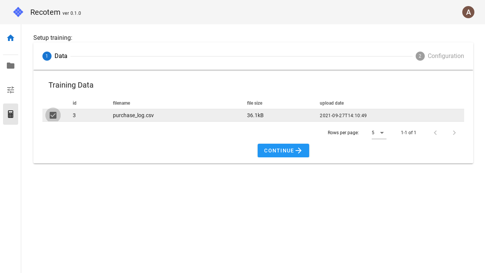

# Start Training View

In this view, you can train a new model using the model parameters you have already created and the training data you have already uploaded.

## 1. Select training data

Select the uploaded training data.

## 2. Select model parameters

Select the parameters of the model created by a tuning job:

Click on "START TRAINING" to start the training. If the training starts successfully, you will see the [model's details view](../trained-model-detail/).
