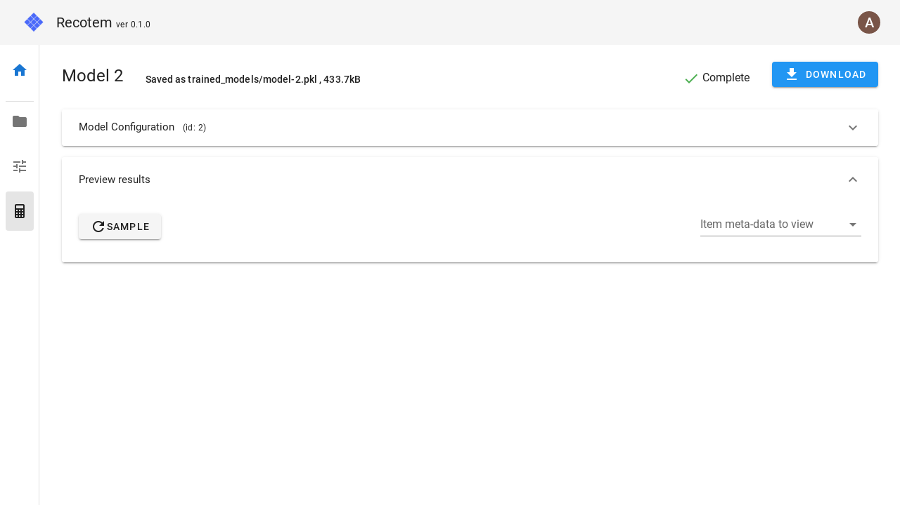

# Model Detail View

Here you can check the model configuration, download the model (which can be done by clicking on the "DOWNLOAD" button), preview the sample output of the trained model.

Clicking on "Preview results" and then "Sample" will give you a preview of what items will be recommended to users with what behavioral history (which will be randomly selected):

If you have uploaded the metadata of your items in the [data management screen](../data-list/), you can link the metadata with the action history and the recommendation results to understand the behavior of the model more intuitively:

