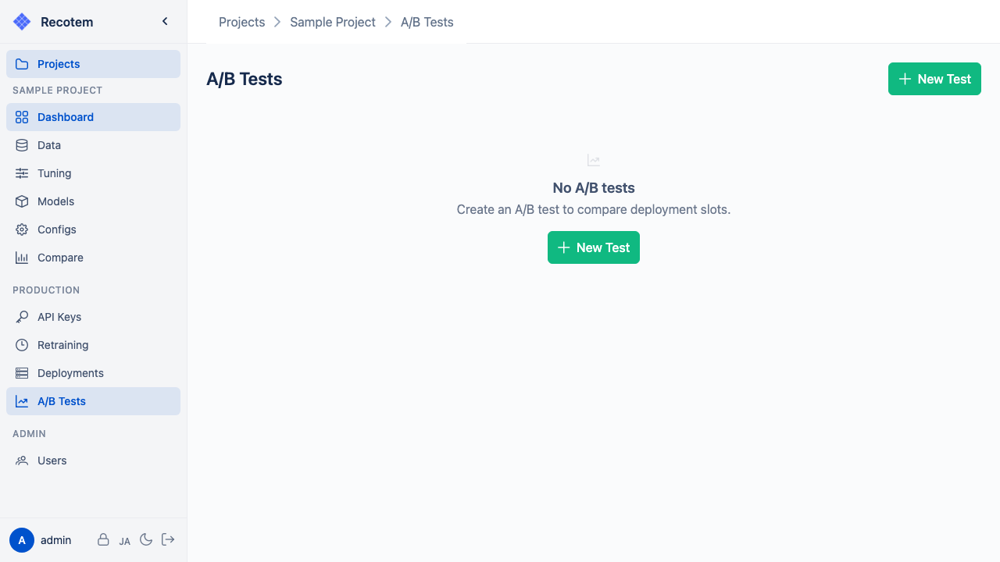
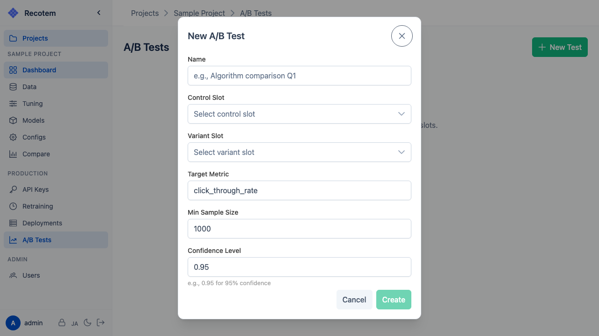

# A/B Tests

Distribute traffic across multiple deployment slots to compare the effectiveness of recommendation models.



## How A/B Testing Works

When you call the project-level recommendation API (`POST /inference/predict/project/{project_id}`), requests are distributed based on the **Weight** values of the [deployment slots](../deployment-slots/).

By recording requests to each slot and conversion events, you can statistically compare model effectiveness.

## Creating an A/B Test

Click the **"New A/B Test"** button to create a test:



Configuration options:
- **Name** --- Identifier for the test
- **Control Slot** --- The baseline deployment slot
- **Variant Slot** --- The deployment slot to compare against the control
- **Target Metric** --- The metric name recorded as conversion events (e.g., `click_through_rate`)
- **Min Sample Size** --- Minimum sample count before statistical analysis is performed (default: 1000)
- **Confidence Level** --- Significance level for statistical testing (default: 0.95 = 95% confidence)

## Impression Tracking

**Impressions are recorded automatically.** Every time the project-level recommendation API returns results, an `impression` event is recorded in the background. You do not need to track impressions manually.

This behavior is enabled by default. To disable it, set the `INFERENCE_AUTO_RECORD_IMPRESSIONS` environment variable to `false`.

::: tip
Auto-recorded impressions include `{"source": "inference_auto"}` in the metadata, making them easy to distinguish from manually recorded events.
:::

## Recording Conversion Events

When a user takes an action (click, purchase, etc.) on a recommended item, record the conversion event using the following API:

```http
POST /api/v1/conversion_event/
```

Since impressions are tracked automatically, you only need to record click and purchase events here.

## Analyzing Results

The A/B test detail view shows conversion rates and statistical significance for each slot.
