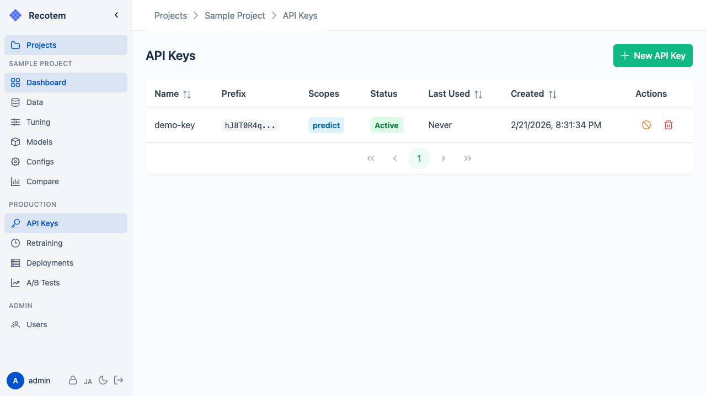
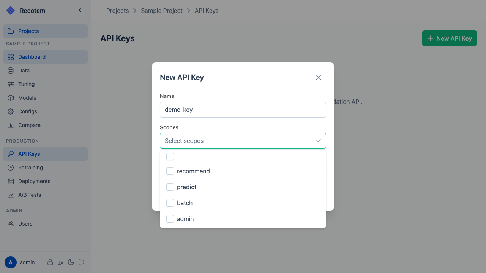
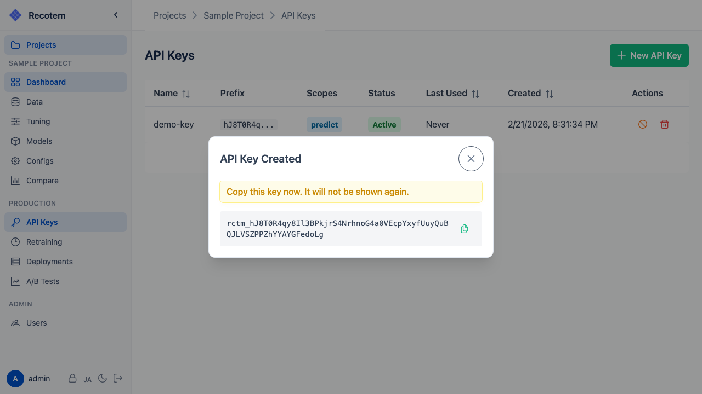

# API Key Management

Scoped API keys are required to access the recommendation API.



## Creating an API Key

Click the **"Create API Key"** button to open the key creation form:



Configuration options:
- **Name** --- Identifier for the key
- **Scopes** --- Permissions granted to the key (multiple selections allowed)
  - `recommend` --- Call the project-level recommendation API (includes A/B routing)
  - `predict` --- Call the model-direct recommendation API
  - `batch` --- Call the batch recommendation API
  - `admin` --- Administrative operations (model training, deployment, etc.)
- **Expiration** --- Expiration date for the key (leave empty for no expiration)

After creation, the API key is displayed once:



::: danger
The API key is never displayed again after this point. Be sure to copy it and store it in a safe place.
:::

## Using an API Key

Include the API key in the request header as follows:

```http
X-API-Key: your-api-key-here
```

## Key List

The key list shows the following:
- **Name** and **Scopes**
- **Last used** --- Useful for security auditing
- **Expiration date**

Delete keys that are no longer needed.
