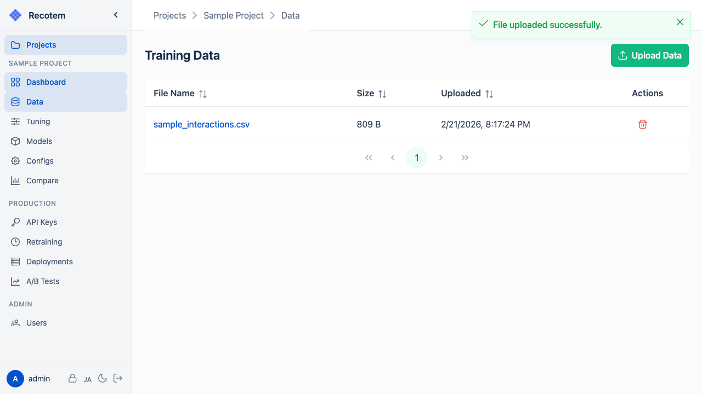
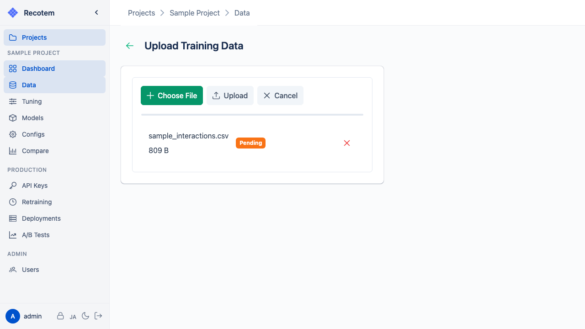

# Data Management View

In this view, you can check and upload training data and item metadata:

## Uploading Training Data

Click the **"Upload Training Data"** button to open the upload dialog:

Select a CSV file to upload. The expected data format is as follows:

| user_id | item_id | timestamp  |
|---------|---------|------------|
| 1       | 101     | 2024-01-01 |
| 1       | 102     | 2024-01-02 |
| 2       | 101     | 2024-01-03 |

## Uploading Item Metadata

Uploading item metadata (categories, prices, etc.) enables more intuitive recommendation previews in the [Model Detail View](../trained-model-detail/). Click the **"Upload Item Metadata"** button to upload in the same way.
