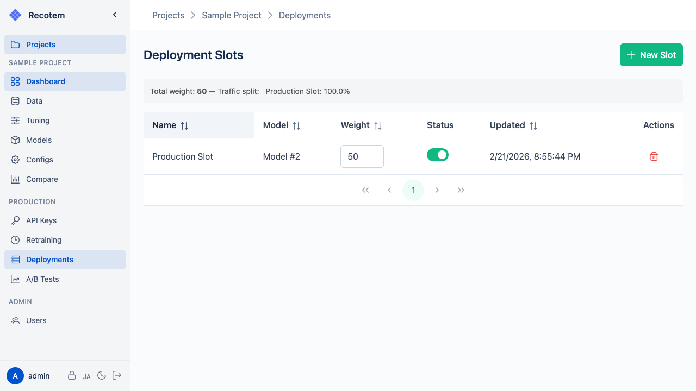
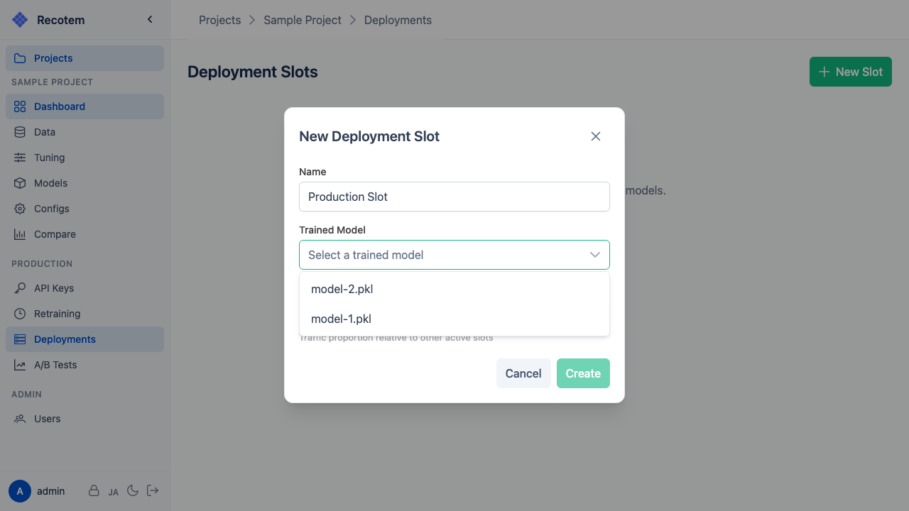

# Deployment Slots

Deployment slots are endpoint configurations for serving trained models as a recommendation API.



## Creating a Slot

Click the **"New Slot"** button to open the slot creation dialog:



Configuration options:
- **Name** --- Identifier for the slot
- **Model** --- The trained model to deploy
- **Weight** --- Traffic distribution weight for A/B testing

## Using Slots

Once a deployment slot is created, you can access the model through two types of endpoints:

### Direct Model Endpoint
```http
POST /inference/predict/{model_id}
```

### Project-level Endpoint (A/B Routing)
```http
POST /inference/predict/project/{project_id}
```

The project-level endpoint distributes requests based on the configured slot **Weight** values. This can be used to run [A/B tests](../ab-tests/). Each request automatically records an impression event for the selected slot, so you don't need to track impressions manually.

## Enabling/Disabling Slots

Slots can be toggled on or off. Disabled slots will not receive any traffic.

::: warning
Calling the recommendation API requires an [API key](../api-keys/) with the **predict scope**.
:::
