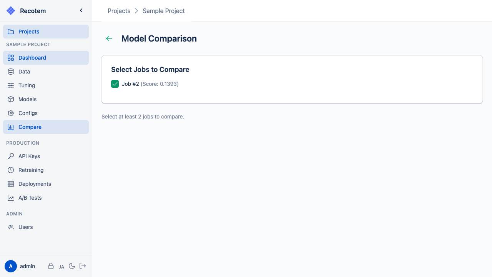

# Model Comparison View

Compare multiple trained models side by side:

## How to Compare

Select multiple models in the [Model Management View](../trained-model-list/) and click the **"Compare"** button to navigate to the comparison view.

## Comparable Information

| Item | Description |
|---|---|
| **Algorithm** | The recommendation algorithm used |
| **Score** | Score on the tuning evaluation metric |
| **Parameters** | Hyperparameter details |
| **Training Data** | Training data used |
| **Created at** | Creation date and time |

Use this view to help decide which model to deploy.
