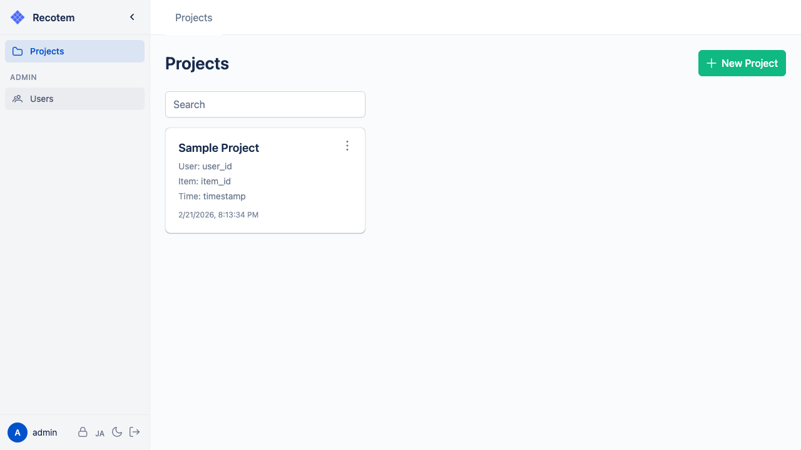
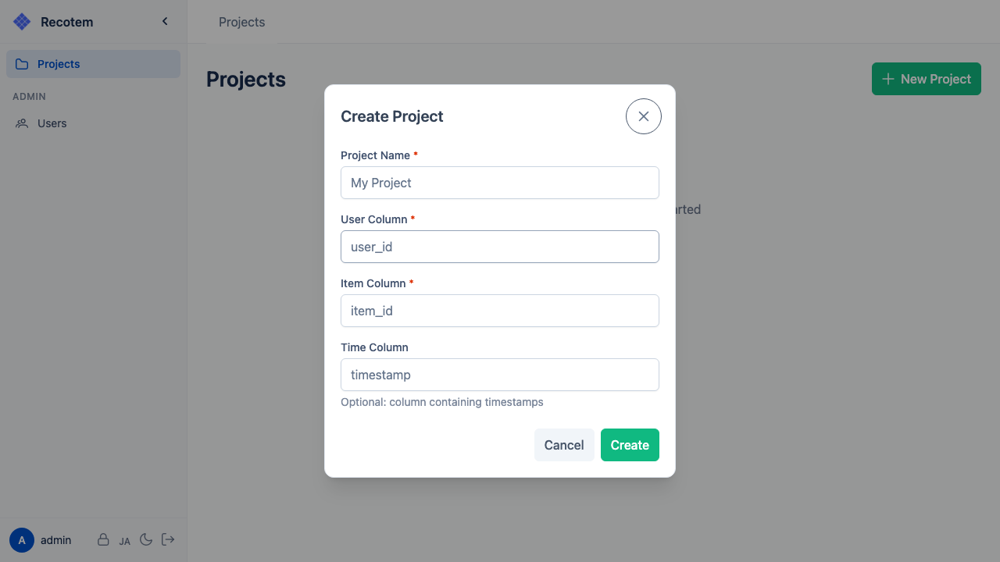

# Project Selection View

You can select from existing projects in the project list:

To create a new project, click the **"New Project"** button in the upper right. Enter the following:

1. **Project name** --- must be unique within the same user
2. **User column name** --- the column name corresponding to the user ID in your interaction data (e.g., `user_id`)
3. **Item column name** --- the column name corresponding to the item ID in your interaction data (e.g., `item_id`)

You can also optionally set a **timestamp column name**. If set, time-based splitting becomes available during [data split configuration](../start-tuning/#_2-split-config-data-splitting).

Click "Create" to create the project and navigate to the dashboard.
