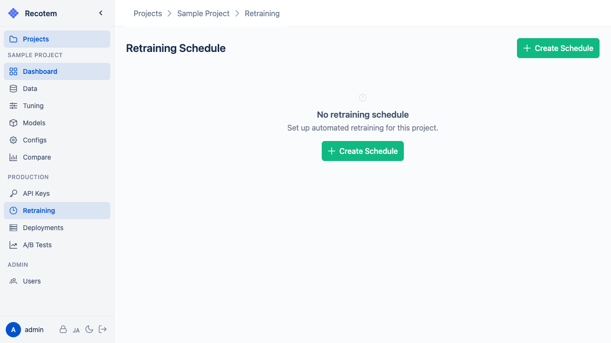
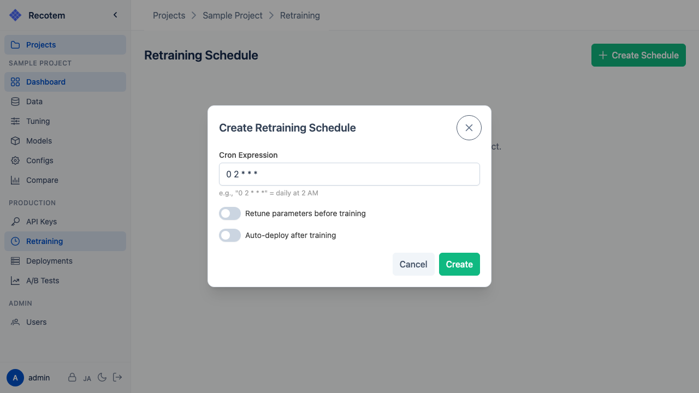

# Scheduled Retraining

Set up scheduled retraining to automatically retrain models on a defined schedule.

## Setting Up a Schedule

Click the **"New Schedule"** button to create a schedule:

Configuration options:
- **Cron Expression** --- Schedule in cron format (e.g., `0 2 * * *` = daily at 2 AM)
- **Retune parameters before training** --- Whether to re-run parameter tuning before each training run
- **Auto-deploy after training** --- Whether to automatically deploy the trained model after completion

## Execution History

The schedule detail view shows past execution history (start time, duration, status).

::: tip
Scheduled retraining is especially useful for systems where new data is continuously accumulated. By periodically auto-deploying models trained on the latest data, you can maintain recommendation accuracy.
:::
