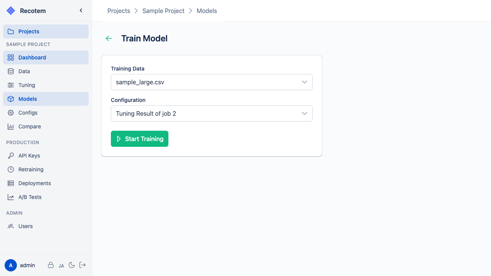

# Start Training View

In this view, you can create a new recommendation model by combining training data with a model configuration.

## Select Training Data

Select the uploaded training data:

## Select Model Configuration

Select a model configuration generated by a tuning job or manually created:

Click **"START TRAINING"** to start the training. You will be navigated to the [Model Detail View](../trained-model-detail/).

::: tip
Model configurations can also be reviewed and edited in the [Model Configuration View](../model-config/).
:::
