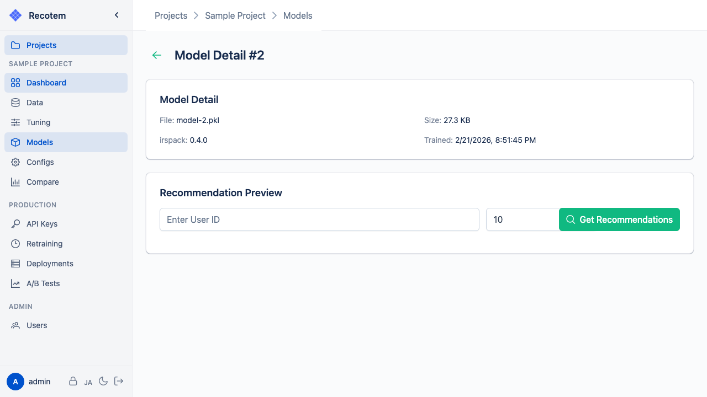
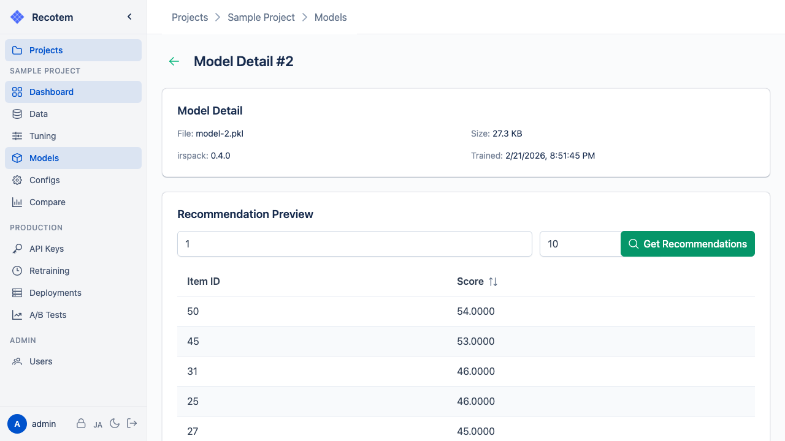

# Model Detail View

In this view, you can check the model configuration, download the model, and preview recommendation results:

## Model Information

You can review the model configuration (algorithm, parameters), training data, and evaluation scores.

Click the **"DOWNLOAD"** button to download the model file.

## Previewing Recommendation Results

Open the **"Preview results"** panel and click **"Sample"** to see recommendation results for a randomly selected user:

If you have uploaded item metadata in the [Data Management View](../data-list/), you can link the metadata for a more intuitive preview:

