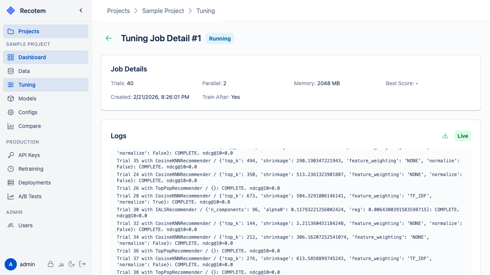
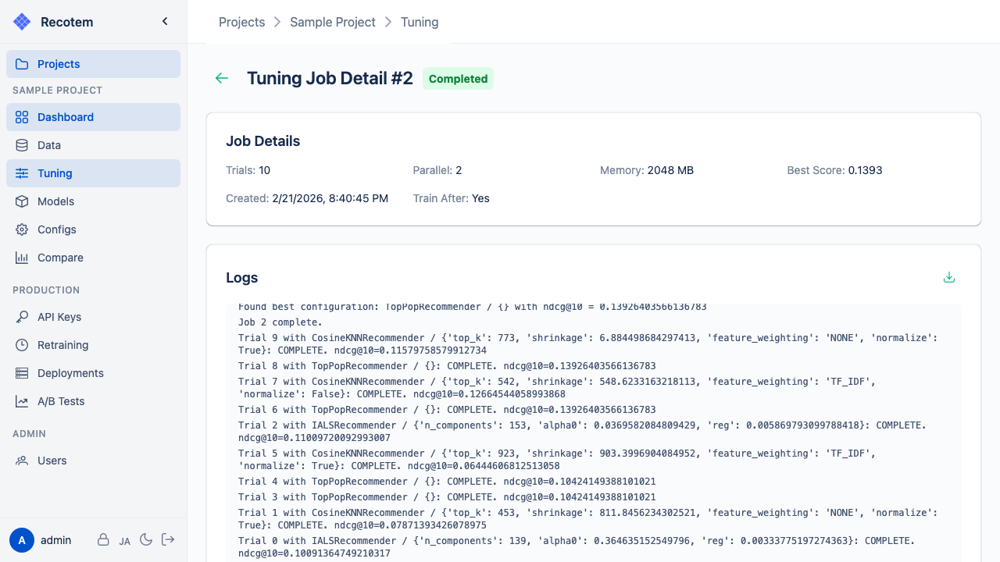

# Tuning Job Detail View

This view lets you check the settings and monitor the progress of a tuning job. While running, the status shows **"Running"** with a **"Live"** badge and logs update in real time:

## Viewing Logs

The **"Logs"** section shows each trial's result in real time as the job progresses:

## Viewing Results

When the job finishes successfully, the status changes to **"Completed"** and the best score appears in the **"Job Details"** section:

What you can see after completion:
- **Best Score** — the evaluation score achieved with the best parameters found
- If **Train After: Yes** was configured, a model is automatically trained from the best configuration (visible in the [Trained Models](../trained-model-list/) page)
- If auto-training was disabled, a **"Train Model"** button appears to start training manually
