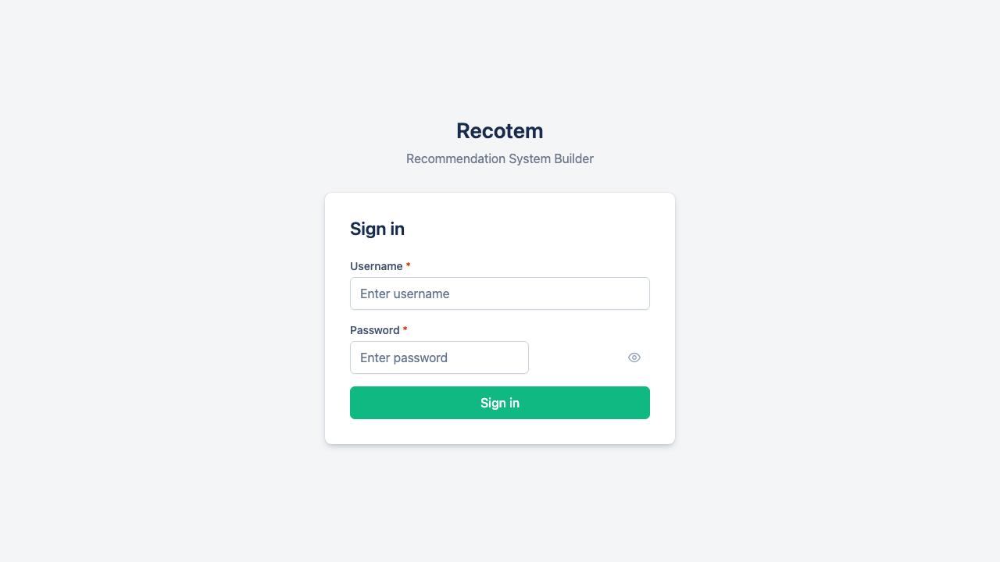

# Installation

## Docker Installation

Recotem runs on Docker. First, install the latest Docker from the [Docker official page](https://docs.docker.com/get-docker/).

## Starting Recotem

### Clone the Repository

```bash
git clone https://github.com/codelibs/recotem.git
cd recotem
```

### Start the Services

```bash
docker compose up -d
```

The first startup will take some time to download images and build containers.

### Accessing Recotem

Go to [http://localhost:8000](http://localhost:8000). If you see a login screen like the one below, the application has started successfully.

Default login credentials:

- Username: `admin`
- Password: Value of the `DEFAULT_ADMIN_PASSWORD` environment variable (default: `very_bad_password`)



### Stopping Recotem

```bash
docker compose down
```
