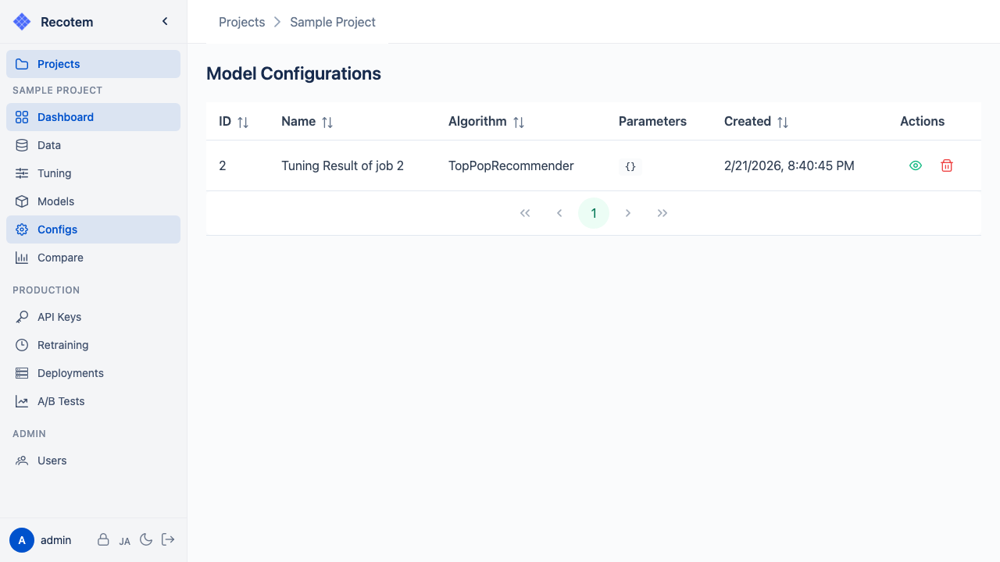

# モデル設定管理画面

モデル設定（ModelConfiguration）は、推薦アルゴリズムとそのハイパーパラメータの組み合わせを保存したものです。チューニングジョブの結果として自動生成されるほか、手動で作成することも可能です。

## モデル設定の確認

一覧には以下の情報が表示されます:
- **名前** — モデル設定の識別名
- **アルゴリズム** — 使用する推薦アルゴリズム（IALS、SLIM、RP3beta など）
- **作成元** — チューニングジョブから自動生成 or 手動作成
- **作成日時**

行をクリックすると詳細が表示されます:

## モデル設定の使用

モデル設定は[モデル学習画面](../start-training/)でモデルを学習する際に選択します。同じモデル設定を使って複数のモデル（データセットや時期の異なるもの）を作成することができます。

::: tip
チューニングジョブ実行時に "Train a model using the full data" オプションを有効にすると、チューニング完了後に自動的にモデル設定が生成されモデルが学習されます。
:::
