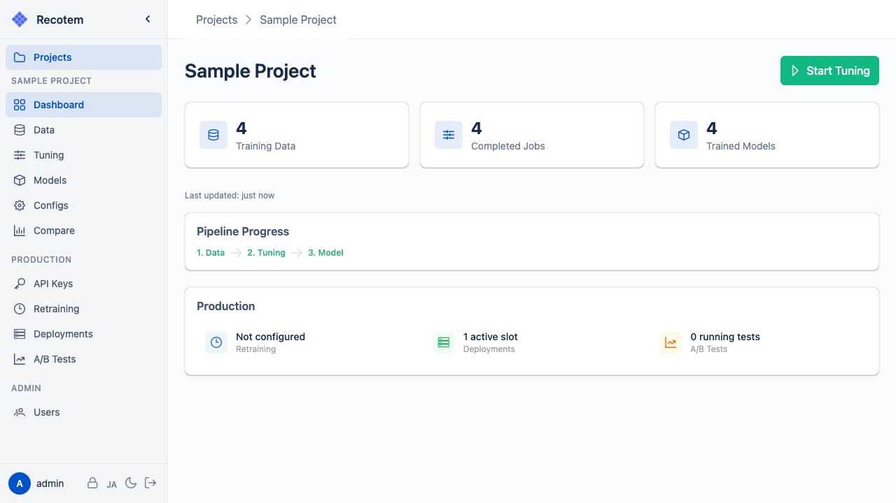

# プロジェクトダッシュボード

プロジェクトを選択すると、ダッシュボードが表示されます。ダッシュボードでは、プロジェクトの概要統計が確認できます:

ダッシュボードには以下の情報が表示されます:

- **Training Data** — アップロード済み学習データの件数
- **Tuning Jobs** — 実行済みチューニングジョブの件数
- **Trained Models** — 作成済み学習済みモデルの件数
- **Deployment Slots** — 設定済みデプロイメントスロットの件数

左のサイドバーから各機能ページへナビゲートできます。
