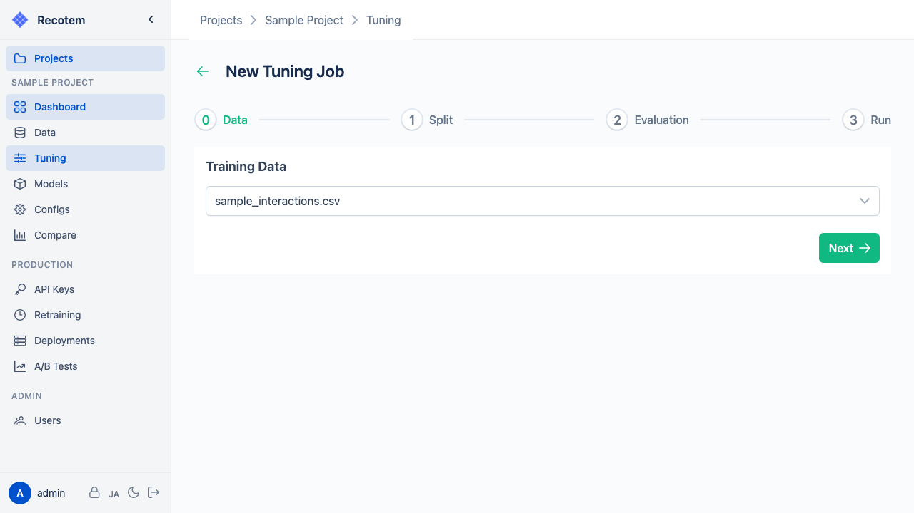
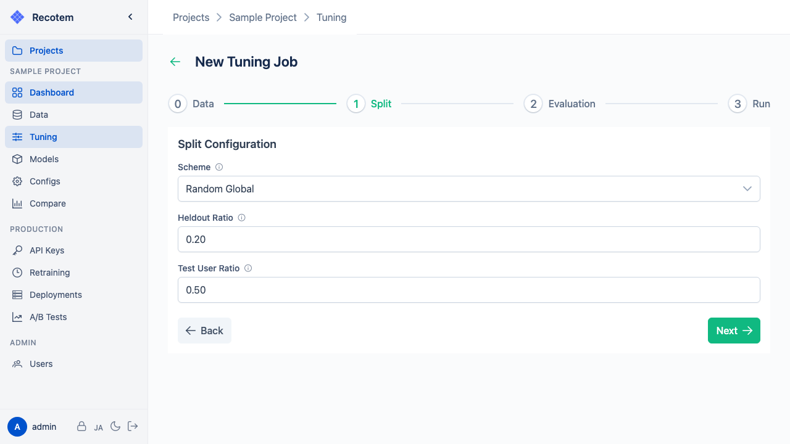
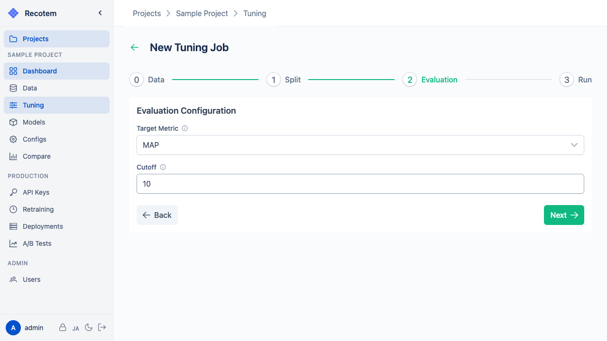
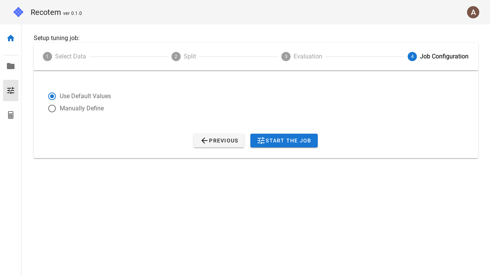
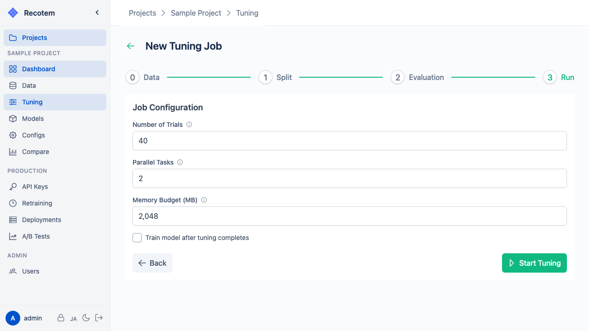

# チューニング設定画面

この画面では、4 つのタブに分けてチューニングジョブを設定します。

1. **Data** — 学習データの選択
2. **Split Config** — 学習/検証セットへの分割設定
3. **Evaluation Config** — 評価指標の設定
4. **Run** — チューニングジョブの設定

## 1. Data — 学習データの選択

アップロード済みの学習データを選択します:

## 2. Split Config — データ分割設定

学習データを訓練/検証セットに分割する方法を設定します。

**Scheme** でランダム分割か時系列分割かを選択します:

タイムスタンプ付きデータでは **"Time Global"** を選択することで時系列順の分割が可能です:

設定項目:
- **Scheme** — `Random Global`（ランダム分割）または `Time Global`（時系列分割）
- **Heldout Ratio** — 各ユーザーのアイテムうち何割を検証データに回すか（デフォルト: 0.20）
- **Test User Ratio** — 何割のユーザーに対して分割を行うか（デフォルト: 0.50）

## 3. Evaluation Config — 評価指標設定

最適化する評価指標を設定します。デフォルトでは NDCG@10 が使用されます:

必要に応じて指標を変更できます（例: MAP）:

設定項目:
- **Target Metric** — NDCG / MAP / Recall / Hit の 4 指標から選択
- **Cutoff** — 上位何件で指標を計算するか（デフォルト: 10）

## 4. Run — チューニングジョブ設定

チューニングジョブの実行パラメータを設定します。チューニング後に自動でモデル学習する場合は "Train model after tuning completes" にチェックを入れます:

設定項目:
- **Number of Trials** — 何試行だけパラメータを探索するか（デフォルト: 40）
- **Parallel Tasks** — 並列実行数（デフォルト: 2）
- **Memory Budget (MB)** — メモリ使用量の目安上限（デフォルト: 2048）
- **Train model after tuning completes** — チューニング終了後に全データで自動学習するかどうか

**"Start Tuning"** ボタンをクリックするとジョブが開始され、[チューニングジョブ詳細画面](../tuning-job-detail/)へ移動します。
