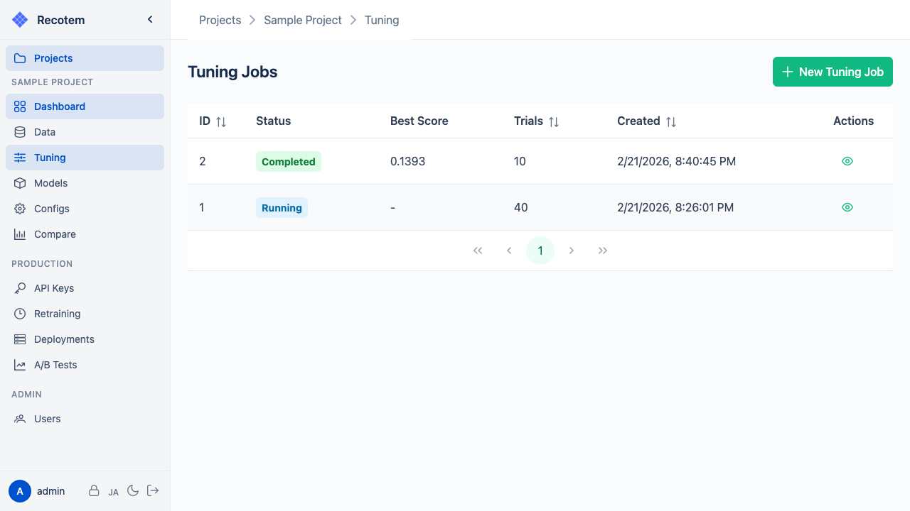

# チューニングジョブ一覧画面

この画面では、プロジェクト内のチューニングジョブ一覧を確認できます:

各ジョブのステータス（PENDING / RUNNING / COMPLETED / FAILED）や開始時刻が表示されます。
行をクリックすると[ジョブ詳細画面](../tuning-job-detail/)へ移動します。

新しいチューニングジョブを作成するには **"New Tuning Job"** ボタンをクリックし、[チューニング設定画面](../start-tuning/)へ移動します。
