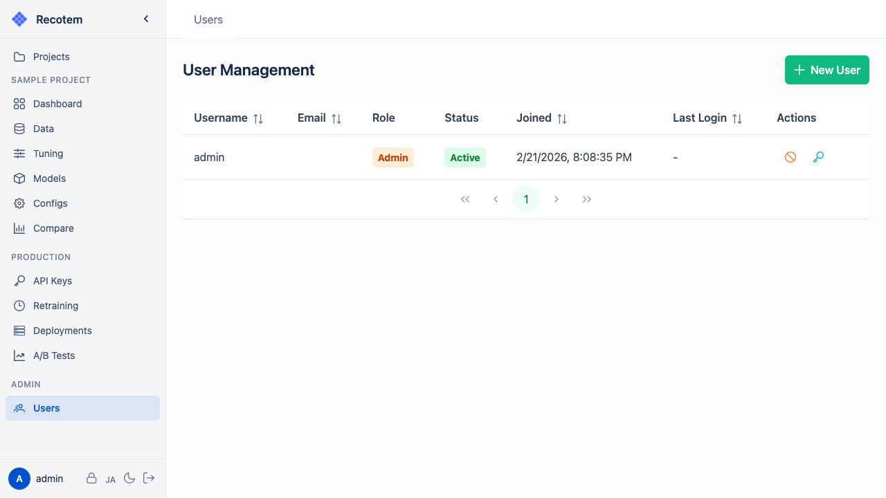
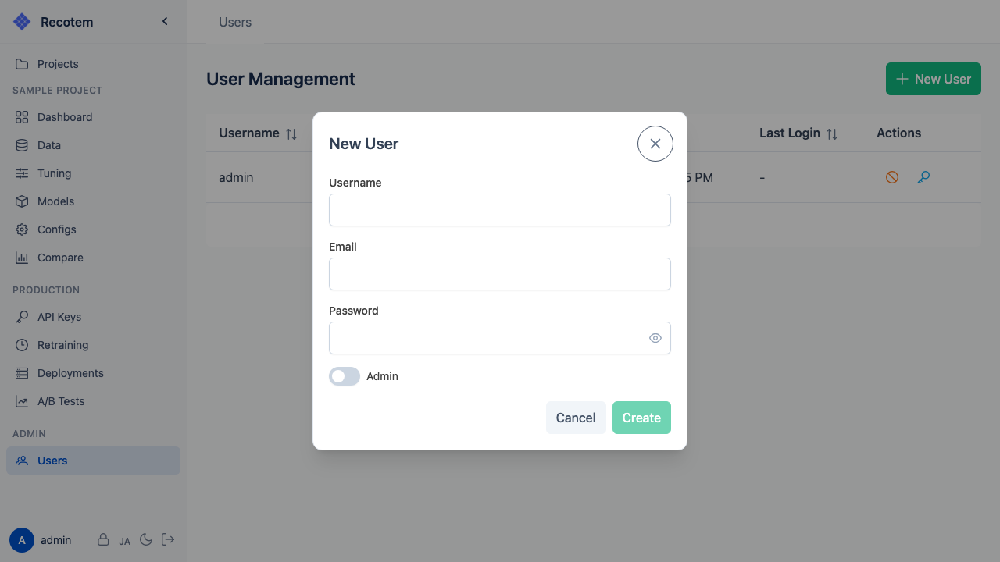

# ユーザー管理

::: warning
この画面はスタッフ権限（管理者）を持つユーザーのみアクセスできます。
:::

ユーザー管理画面では、Recotem にアクセスできるユーザーの追加・削除・権限管理を行います:

## ユーザーの追加

**"Create User"** ボタンをクリックするとユーザー作成フォームが表示されます:

設定項目:
- **ユーザー名** — ログイン時に使用するユーザー名
- **メールアドレス** — ユーザーのメールアドレス（任意）
- **パスワード** — 初期パスワード
- **Admin** — 有効にすると管理者権限が付与され、ユーザー管理画面へのアクセスが許可されます

## ユーザーの削除

一覧からユーザーを選択し、削除操作を行います。

::: warning
管理者ユーザー（`admin`）の削除には注意してください。システムへのアクセスが失われる可能性があります。
:::
