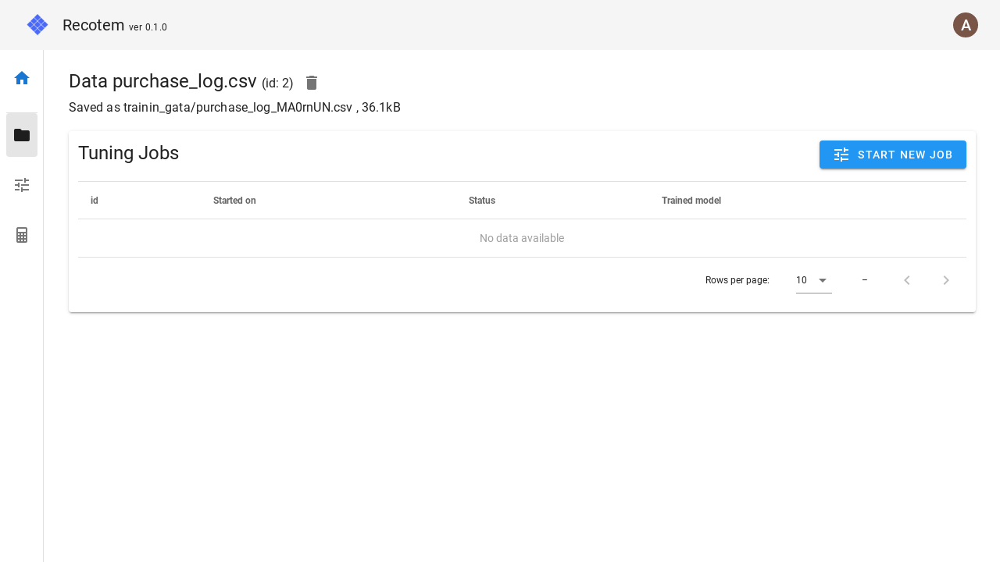

# Data Detail View

In this view, you can

1. view the details of data
1. Delete the data
1. display the list of tuning jobs associated with this data

You can also click "START NEW JOB" to [start tuning with this data specified](./start-tuning-with-data).

