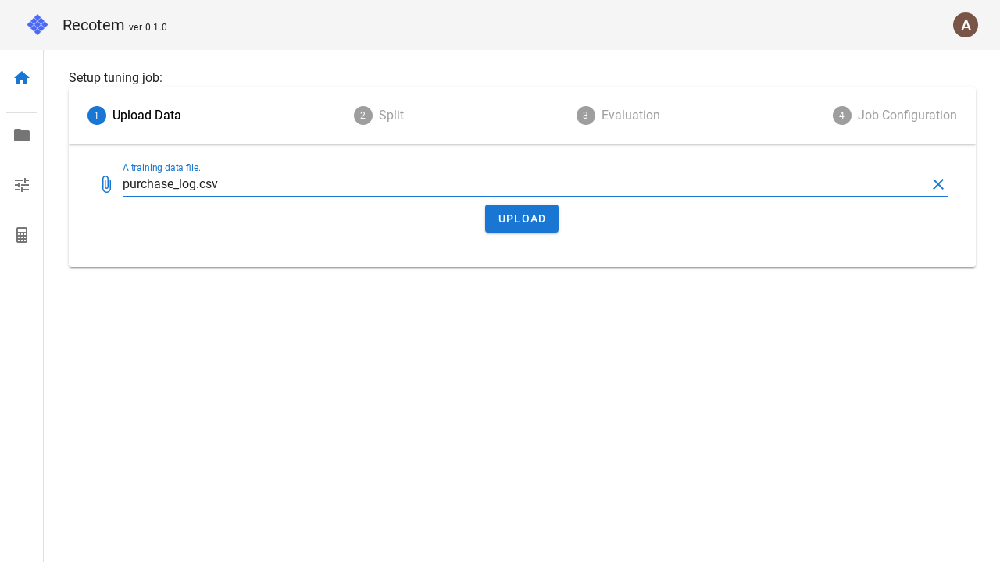

# Tuning Configuration View (with data upload)

In this view, you can set up tuning job in four steps.
Each of these steps corresponds to the following:

1. Uploading data
1. Setting up the split into training/validation sets
1. Setting up evaluation metrics
1. setting up the tuning job

All of these steps except for `1. Uploading data` can be found in the [tuning configuration view](../start-tuning).

To specify the data here, click on the field labeled "A training data file" and select the training data to be uploaded. At this time, the file to be uploaded must be a table data that contains columns for users and columns for items that were set when the project was created.

Once the file selection is complete, you can proceed to Step 2.

