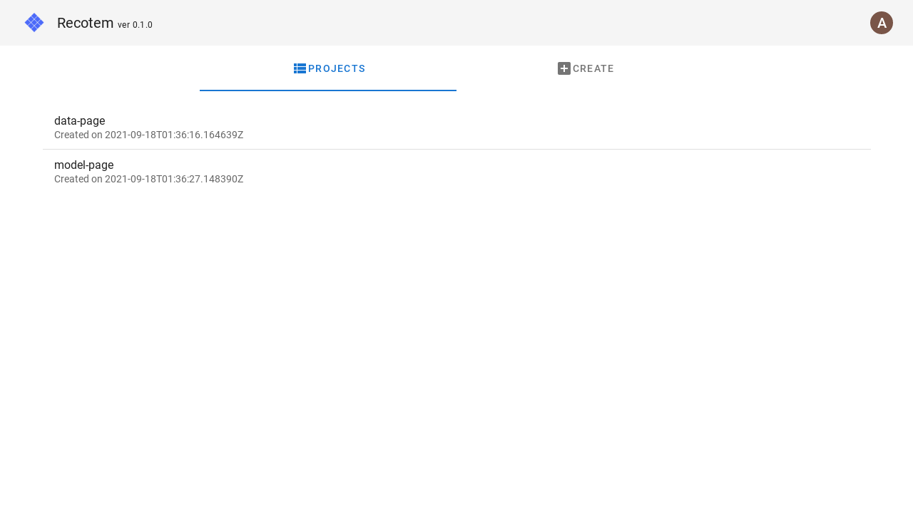
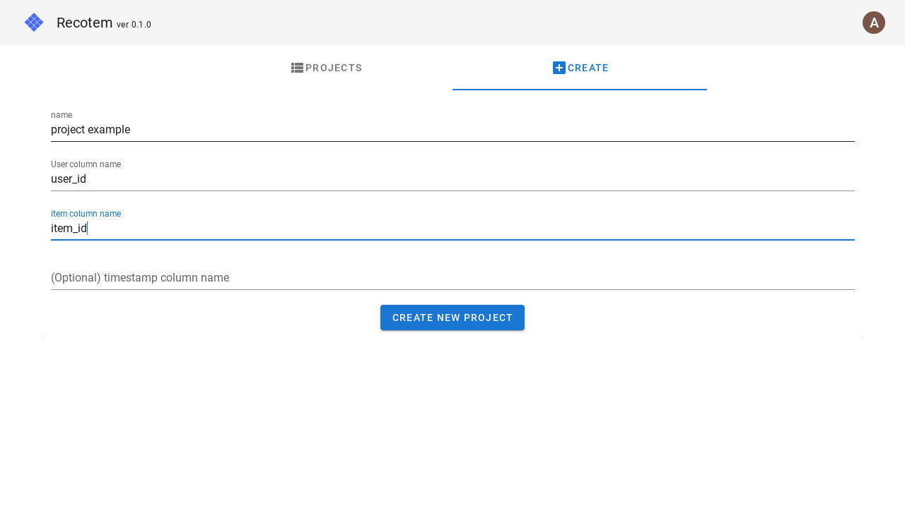

# Project Selection View

You can select a project that has already been created as follows:

To create a new project, got to the "Create" tab and enter

1. the project name (it must not overlap with any existing project name)
1. the name of the column corresponding to the user (`user_id` in the example below)
1. the name of the column corresponding to the item (`item_id` in the example below).

You can also optionally enter the name of the column corresponding to the timestamp. In that case, the timestamp will be used for [data split](../start-tuning/#_2-data-splitting-setting) during the tuning.

