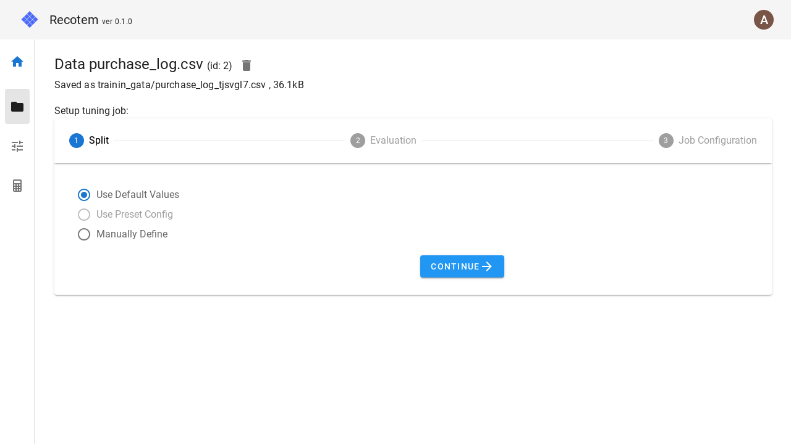

# Tuning Setting View (with data selected)

If you come to this view via [data management view](../data-list) or [data detail view](../data-detail), you can skip the data specification and start the tuning settings.

The correspondence between each step in this section and the [tuning setting view](../start-tuning) is as follows:

- Step 1 of this view: &leftrightarrow; [Tuning setting view](../start-tuning) Step 2.
- Step 2 of this screen. &leftrightarrow; [Tuning setting view](../start-tuning) Step 3.
- Step 3 of this screen. &leftrightarrow; [Tuning setting view](../start-tuning) Step 4.

