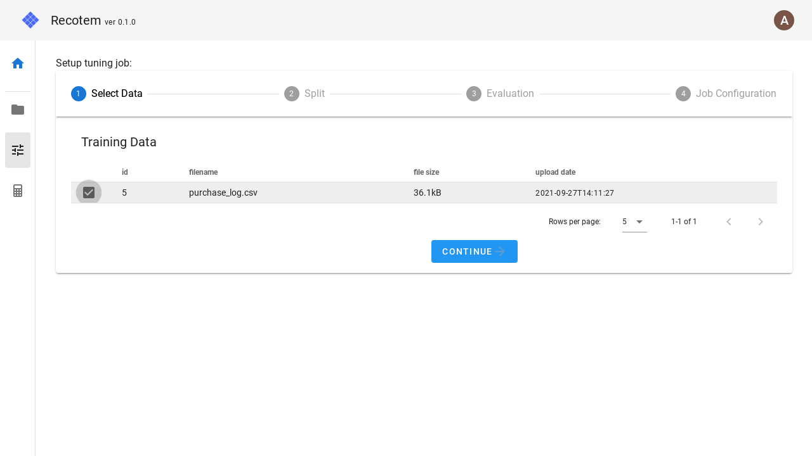
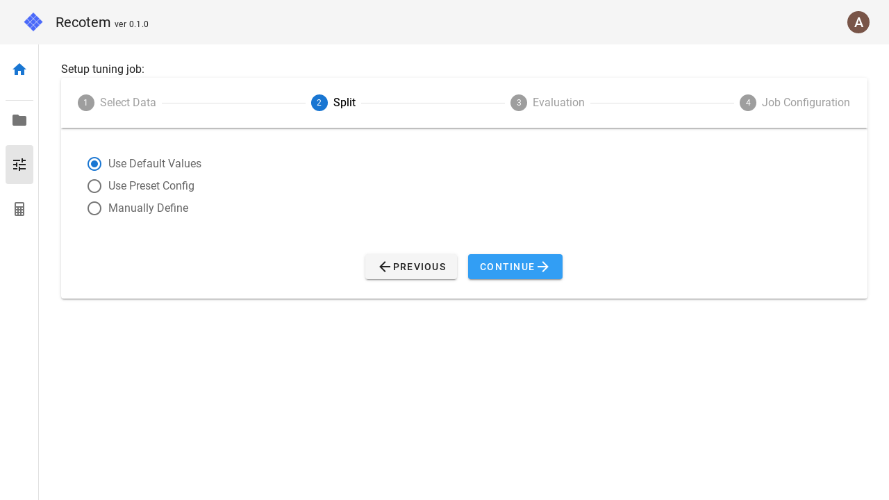
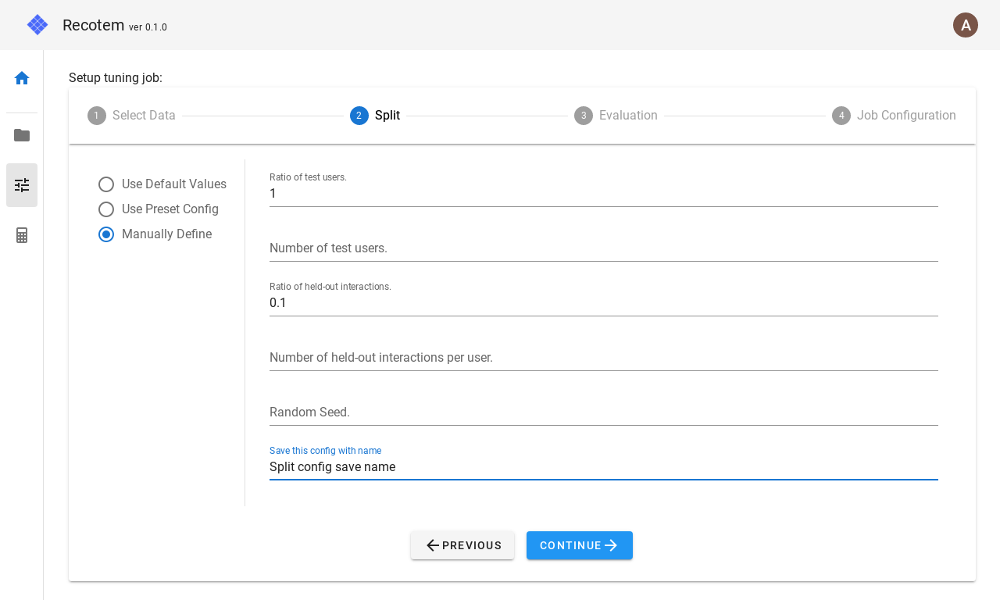
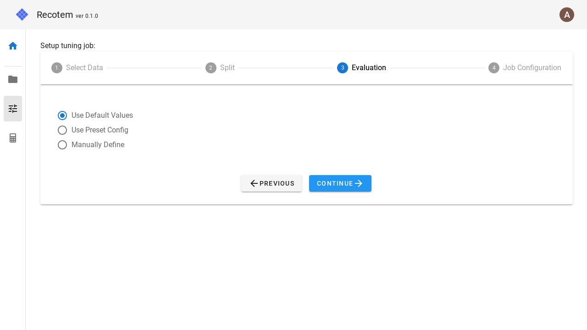
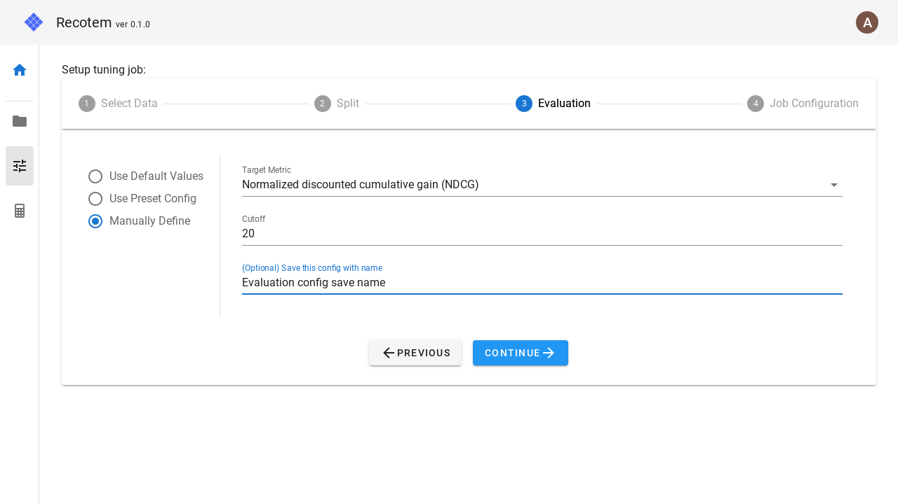
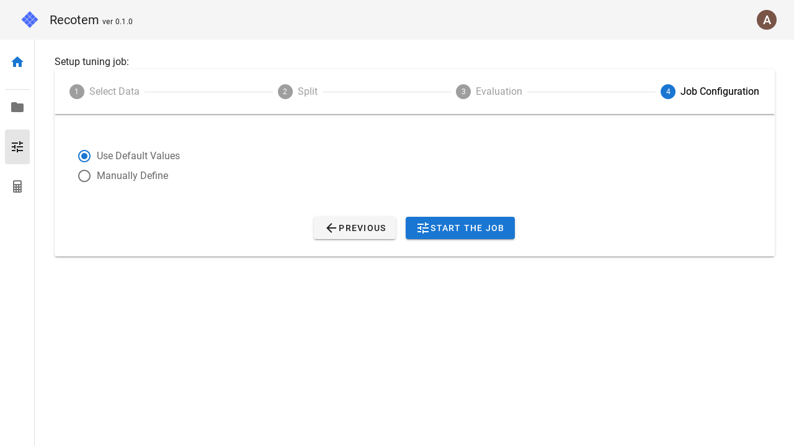
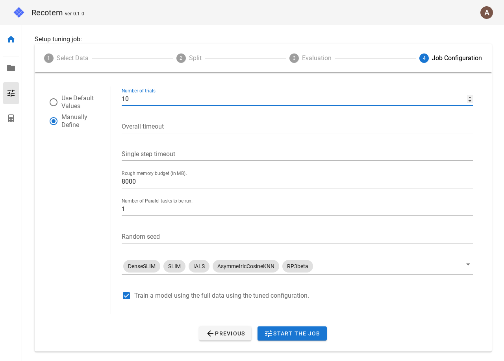

# Tuning Configuration View

In this view, you can perform tuning in four steps.
Each of these steps corresponds to the following:

1. select the uploaded data
1. set up split into training/validation sets
1. set up evaluation metrics
1. set up a tuning job

## 1. Select uploaded data

In step 1, select the pre-uploaded training data.

## 2. Data splitting setting

In step 2, you can specify how to split the training data into training/validation sets.

If you don't want to set anything, you can select "Use default" in the checkbox on the left to use the default value.

If you want to make advanced settings, select "Manually Define".

In this mode, the following parameters can be configured.

- **Ratio of test users** : For what percentage of the users in the training data will the training/validation split be performed. This setting is ignored if `Number of test users` below is set.
- **Number of test users** : How many of the users in the training data will be split into train/validation set.
- **Ratio of held-out interactions** : how many of the items contacted by the users that will be validated will be sent to the validation set. This setting is ignored if `Number of held-out interactions per user` below is set.
- **Number of held-out interactions per user** : How many of the items contacted by the user for which the train/validation split will be done will be turned into validation data. If the user has less than the number of held-out interactions, the number of held-out interactions for training will be 0.
- **Random seed**: Random seed for the split.
- (Optional)**Save this config with name** : Save the configuration with the name listed here. The name must not overlap with any existing one. The saved configuration will be available for selection in the "Use Preset Config" checkbox next time.

Based on the values set here, the training/validation split will be performed as follows:

1. Randomly select `Number of test users` or `Number of all users * Ration of test users` from all users.
2. For each of the users selected in 1., `Number of held-out interactions per user` or `Number of contact items for that user * Ratio of held-out interactions` (rounded up) are selected for the validation. During the split,

   - if the column corresponding to the timestamp is specified in [project configuration](../project-list), the item with the newest timestamp will be sent to the validation.
   - if no timestamp column is set, a random item will be selected.

## 3. Accuracy metric setting

In step 3, you can configure what accuracy metric you want to use for optimization.

If you don't want to set anything, you can use the default value by selecting "Use default" in the left checkbox.

If you want to make detailed settings, select "Manually Define".

In this mode, the following parameters can be configured.

- **Target metric** : You can choose from four metrics: NDCG, MAP, Recall, and Hit.
- **Cutoff** : How many items with the highest recommendation score will be used to calculate the above metric.
- (Optional)**Save this config with name** : Save the configuration with the name listed here. However, the name must not overlap with any existing one. The saved configuration will be available for selection in the "Use Preset Config" checkbox next time.

## 4. Configure the tuning job

In the last step, you can configure the tuning job setting. If you do not want to configure anything here, you can use the default values by selecting "Use Default Values" in the left check box.

Select "Manually Define" if you want to make detailed settings.

In this mode, the following parameters can be set

- **Number of trials** : how many trials to be run for different parameters
- **Overall timeout** : overall timeout
- **Single step timeout**: If a trial takes more time than this value (in seconds), force the trial to stop.
- **Rough memory budget** : A (roughly-estimated) upper limit of the memory to use. This allows us to choose algorithms that use less memory.
- **Number of Parallel tasks to be run** : How many parallel tasks to be run for tuning.
- **Random seed** : Random seed.
- **Algorithms** : Select among the candidate algorithms listed here. The following algorithms are available:
  - DenseSLIM
  - SLIM
  - IALS
  - AsymmetricCosineKNN
  - RP3beta
  - TopPop
  - TruncatedSVD
- **Train a model using the full data using the tuned configuration.** : If checked, when the tuning job finishes, a trained model will be created for all the training data (without training/validation split) using the explored parameters.

Finally, click on the "START THE JOB" button to start the tuning job. When the job starts successfully, you will be navigated to the the created [Job Details](./tuning-job-detail).
