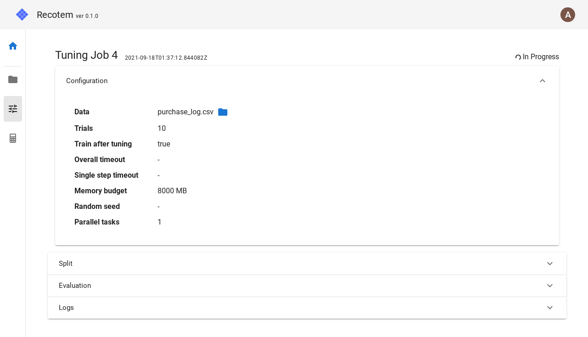
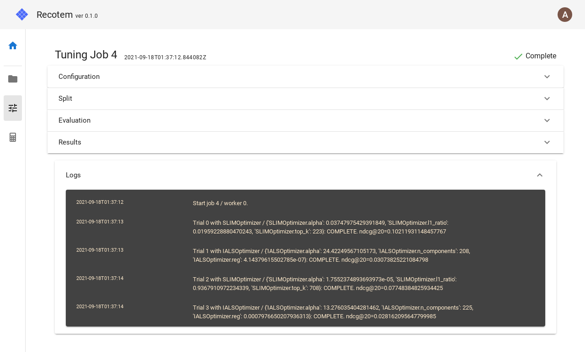
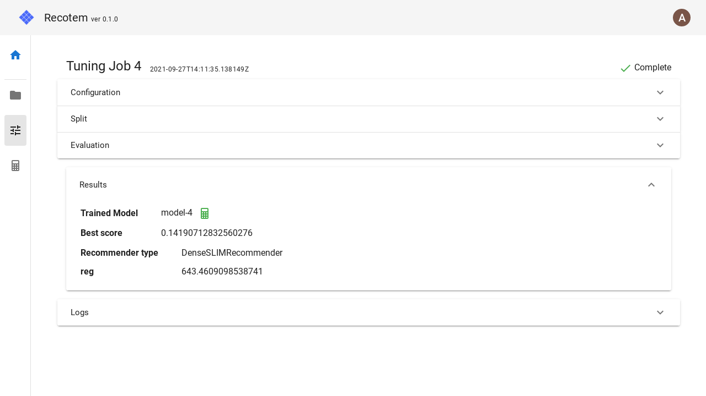

# Tuning Job Detail View

This view allows you to check the settings of a tuning job that is currently in progress or has been completed, and to know the progress of the tuning.

Click on the tab labeled "Logs" to view the job trials that have been completed so far.

When the job finishes successfully, a panel labeled "Results" will appear. Clicking on it will display

- A link to the model that was created using the tuning results (if any)
- The score value calculated with the optimal parameters.
- Details of the optimal parameters

will be displayed.

