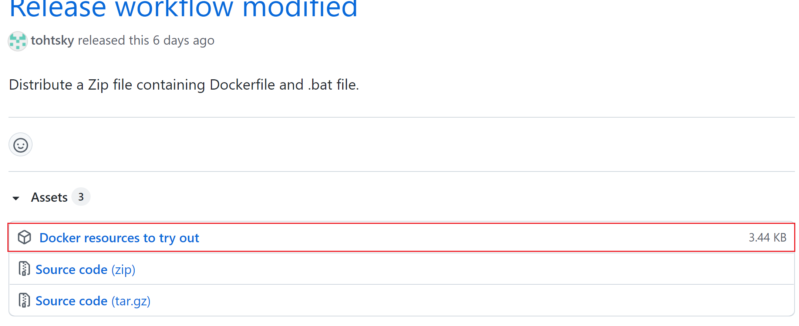
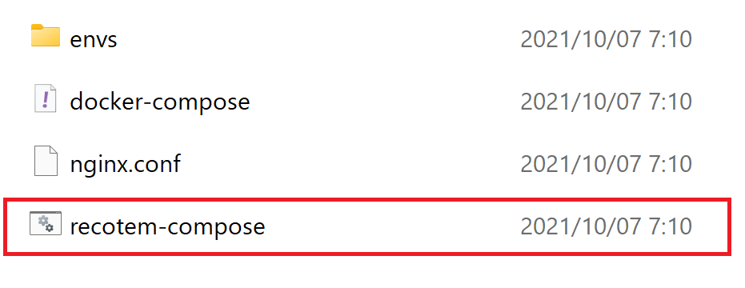
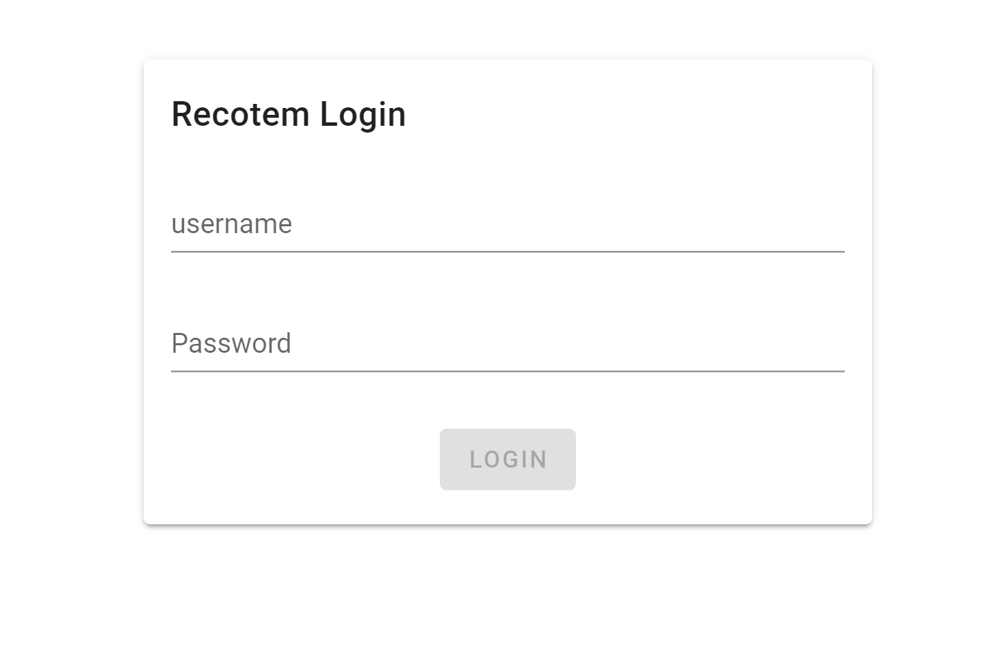

# Installation

## Docker Installation

Recotem is based on Docker and we first need to install latest Docker.

For the instruction, please refer to [Docker official page](https://docs.docker.com/get-docker/).

## Start with recotem-docker

### Windows Instruction

1. [From the latest release page](https://github.com/codelibs/recotem/releases/latest/) download a Zip file labelled "Docker resources to try out".

   

1. Extract the downloaded zip file `recotem-compose-vx.y.z.zip`.
1. In the folder extracted in 2., there is a sub-directory named "recotem-compose", so navigate there. There should be files and sub-directories like this: 

1. Double click on the file `recotem-compose`.
   - You may get a warning by Microsoft defender, but please select "Run" from "Details".
   - For the first time, it will take some time to download the required resources.

::: tip
If the possible warning by Microsoft Defender in Step 4. is not acceptable, you can start recotem without warnings.

- Launch e.g., Windows Power Shell and navigate to the directory described in Step 3. (where `recotem-compose` lies).
- Run
  ```
    docker-compose.exe up
  ```

:::

### Linux & MacOS Instruction

1. [From the latest release page](https://github.com/codelibs/recotem/releases/latest/) download a Zip file labelled "Docker resources to try out".

   

1. Unzip the downloaded zip file `recotem-compose-vx.y.z.zip`.

1. Using the terminal, move to the directory extracted in 2., and execute

```sh
docker-compose up
```

## Accessing Recotem's user interface

Go to [http://localhost:8000](http://localhost:8000). If you see a login view like the one below, you have successfully launched the application. You can now proceed to the tutorial.


