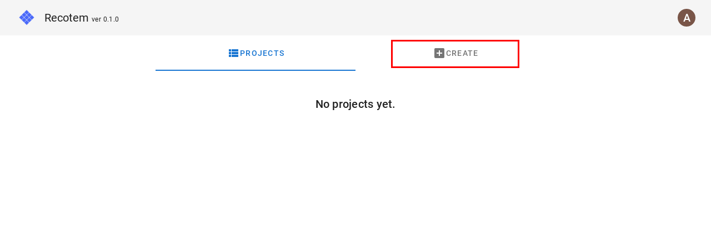
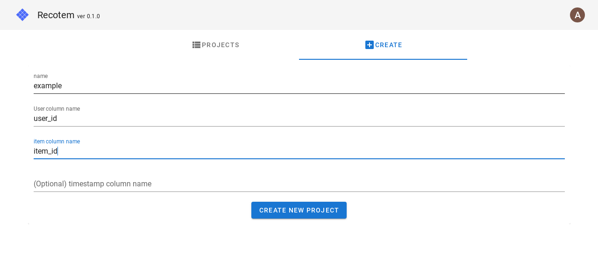
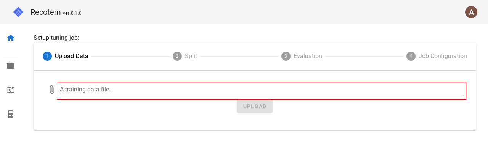
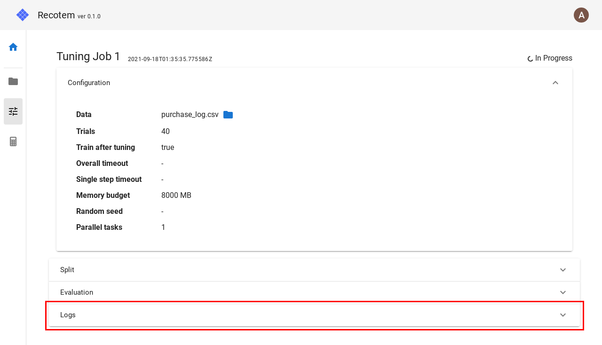
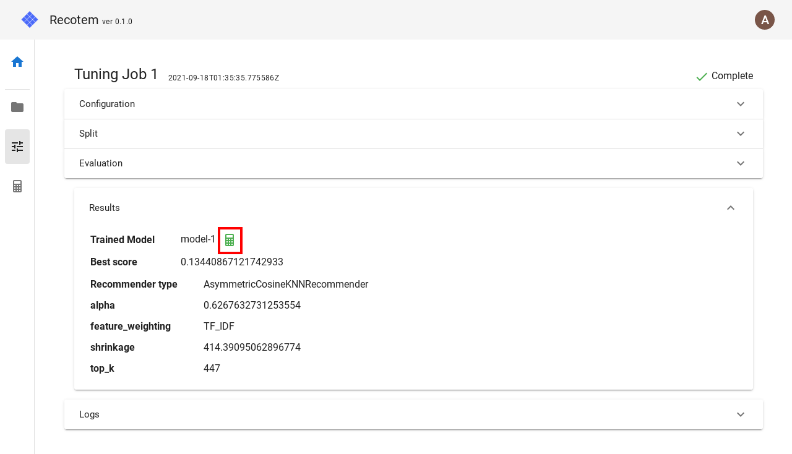
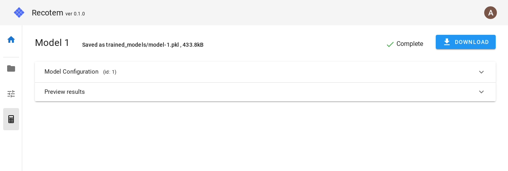
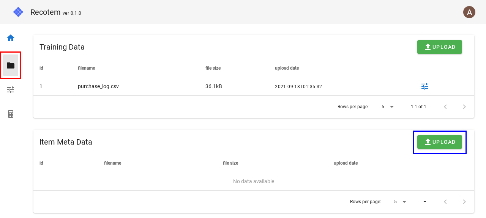
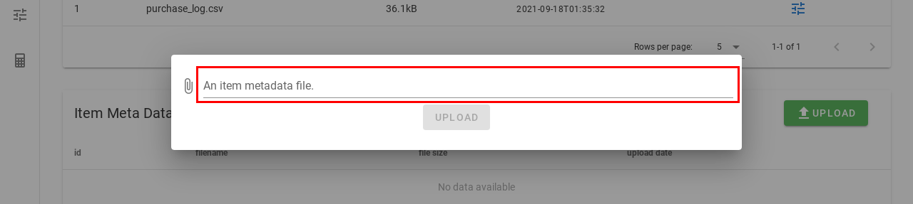
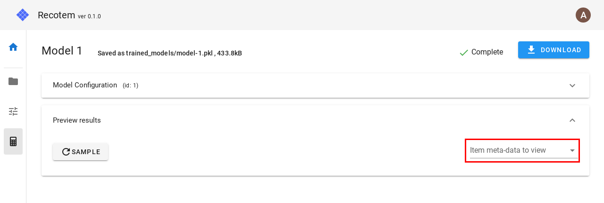

# Tutorial with EC-site data

In this tutorial, we will use (dummy) purchase log data for a fashion e-commerce site to explore the basic usage of recotem. These include

- Specification of the training data format
- Creation a parameter tuning job
- Check of the validity of the recommendation algorithm

## Data preparation

Download the purchase log data `purchase_log.csv` that we will use in this tutorial from <a href="https://raw.githubusercontent.com/codelibs/recotem/refs/tags/v1.0.0/frontend/e2e/test_data/purchase_log.csv" download="purchase_log.csv" >this link</a>. This data is a simple log data which records "who purchased which item":

| user_id | item_id |
| ------- | ------- |
| 1       | 49      |
| 1       | 69      |
| 2       | 21      |
| 2       | 57      |

## Login to recotem

When you access [http://localhost:8000](http://localhost:8000), you will be asked to authenticate on the following screen. Immediately after the installation (described in [the previous page](./installation), you are able to login with the following information.

- username: `admin`
- password: `very_bad_password`

After filling the user information, click "Login" button. Initially, you will be navigated to a view like the one below.
Click on the tab labelled "Create".

## Create a project

The first thing you need in order to use recotem is a unit called "project". Within a single project, multiple data can be used, but the format of the data must be the same.

The format of the data used in this project was as follows:

| user_id | item_id |
| ------- | ------- |
| 1       | 49      |
| 1       | 69      |
| 2       | 21      |

The column name for a user is "user_id" and the column name for an item is "item_id", so enter them exactly as they are:

Clicking on "Create new project", you will see the top view of the project as shown below.

Click "Start upload -> tuning" button.

## Create a parameter tuning job

You are now seeing the following view. Let's set up a job following 4 steps to explore the best algorithm and parameters for our data.

To start with, we first upload `purchase_log.csv` above. Click on the file input box (marked with a red box below) to open the file selection window, and select `purchase_log.csv`.

As shown above, once the training data is selected, you can click the "Upload" button to proceed to the next step.

You will then see a a view like the one shown below (Step 2). "Use default values" checkbox is selected, so click "Continue" to proceed.

Then you should be navigated to Step 3 as shown below. The checkbox is already on "Use default values", so click "Continue" to proceed.

Now you should be on the final step as shown below. Leaving "Use default values" checkbox, click "Start the job" button.

If you see a screen like the one below, the search for the best algorithm has started as expected.

Click the panel named "Logs" to show the progress of the job:

If the top-right status (initially "In progress") becomes "Complete", the parameter tuning has successfully completed. There should then appear a panel named "Results", so open the panel to see the following:

"Results" shows the detailed report for the selected algorithm and parameters. By default, the parameter tuning job will create a recommendation model trained against the entire data (without train/validation split), and you can navigate to the trained model by clicking on the green calculator icon circled red above.

## Examine the validity of the recommender model

You can check the model's validity by examining how it behaves against the input interaction. If you open "Preview results" panel, there should be "Sample" button, and when you click on it,
you can see a JSON representing the result of recommendation

This JSON represents "what items will be recommended for a user with these interactions". However, since we lack the information about items, it is hard to gain insight about the qualitative feature of the model. So let us now upload items' metadata to see friendlier results.

You can download items' metadata `item_info.csv` from [this link](https://github.com/codelibs/recotem/releases/download/v0.1.0.alpha4/item_info.csv).

As you see below, this data contains category & price information about items.

| item_id | category | price |
| ------- | -------- | ----- |
| 1       | formal   | 61    |
| 4       | formal   | 111   |
| 5       | casual   | 106   |
| 6       | casual   | 178   |

To upload the data, click on the icon circled red below to navigate to the data management view, where you should see the training data already uploaded. Click on the "Upload" button circled blue.

You will be prompted to select the file, so click the form and select the `item_info.csv`.
Once you select the file, then click on "Upload" button.

Let us move back the model preview by clicking on the calculator icon circled red below. Click on the frame marked blue below to go to the model detail view again.

Now you should be on the model detail view, so open "Preview results" panel. To preview the recommendation results using the item metadata, click on the frame marked red below and select `item_info.csv`.

When you click on "Sample" button with `item_info.csv` selected, you can confirm "what kind of items will be recommended for a user who have already purchased these items" in a friendlier way.

By clicking on "Sample" you can refresh the information for another user. The result will reflect users preference (`formal` vs `casual` genre and the price), and now we know the model's output is meaningful.
