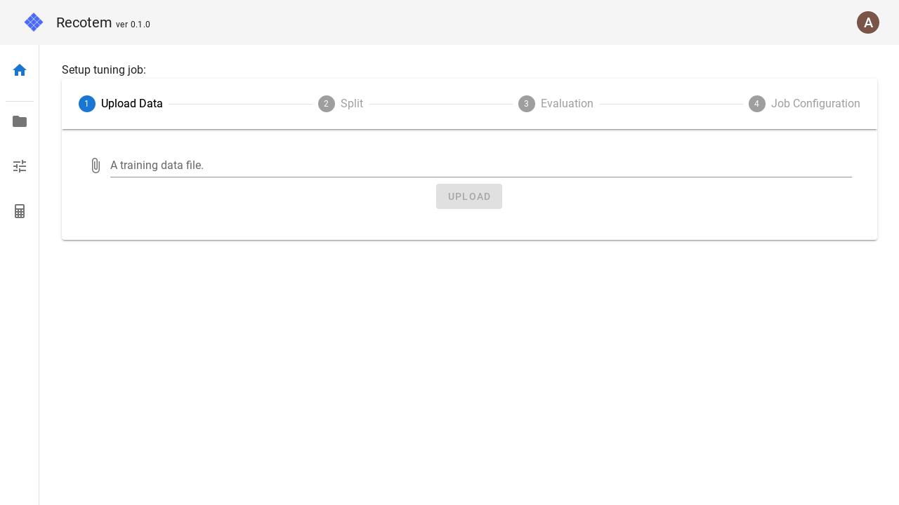
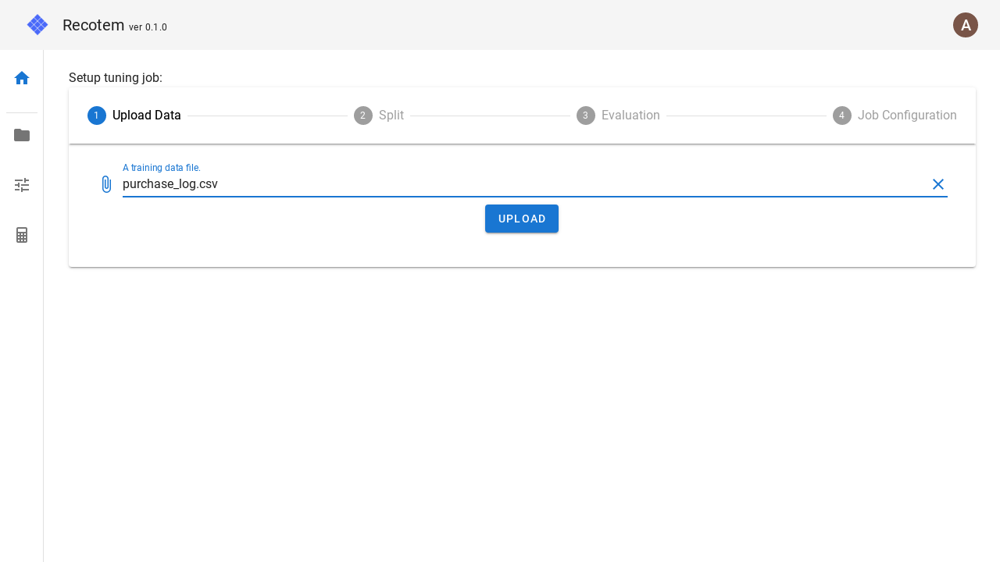

# チューニング設定画面(アップロード込み)

この画面では、4 ステップに分けてチューニングを行うことが出来ます。
これらのステップは、それぞれ以下に対応します。

1. データのアップロード
2. 学習/検証セットへの分割設定
3. 評価指標の設定
4. チューニングジョブの設定

これらのステップのうち、`1. データのアップロード`以外は[チューニング設定画面](../start-tuning)と同じで、データの指定方法のみがことなります。ここでのデータ指定方法は、"A training data file"と書かれた部分をクリックし、
アップロードする学習データを選択します。
この時、アップロードされるファイルはプロジェクト作成時に設定したユーザーを表す列、アイテムを表す列を含むテーブルデータである必要があります。

ファイル選択が完了すると次に進むことができます。

