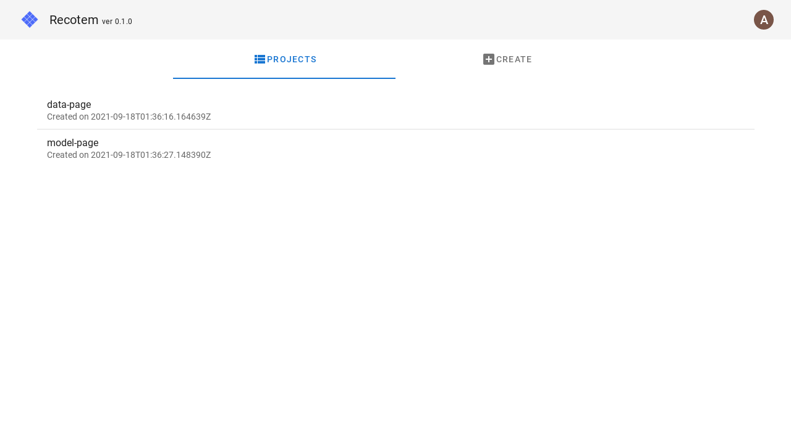

# プロジェクト選択画面

以下のように作成済みプロジェクトを選択することができます:

また、新規プロジェクトを作成することができます。
新規プロジェクトの作成には、

1. プロジェクト名(既存のプロジェクト名と重複しない必要があります)
1. ユーザーに相当するカラムの名前(下の例では`user_id`)
1. アイテムに相当するカラムの名前(下の例では`item_id`)

を入力します。また、任意でタイムスタンプに相当するカラムの名前を入力できます。

