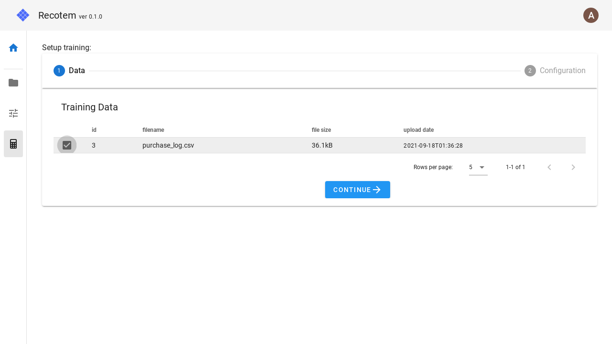
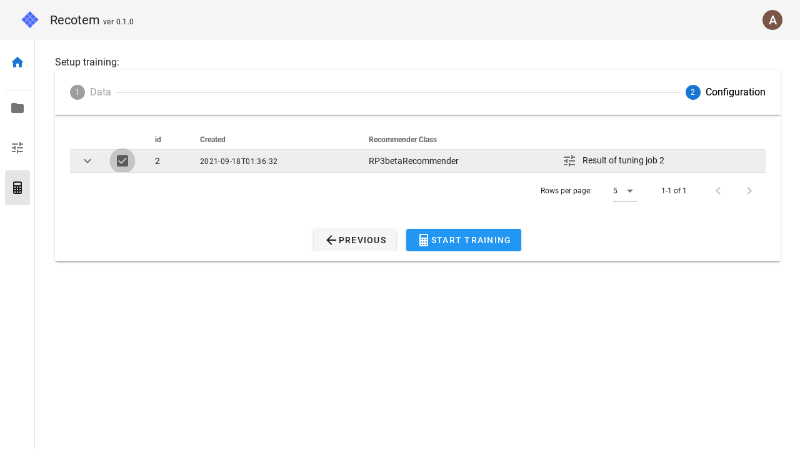

# モデル学習画面

この画面では、作成済みのモデルパラメータとアップロード済みの学習データを用いて、新たにモデルを作成します。

## 1. 学習データの選択

アップロード済み学習データを選択します。

## 2. モデルパラメータの選択

チューニングジョブによって作成されたモデルのパラメータを選択します:

"START TRAINING"を推して学習を開始します。正常に学習が開始されれば、作成された[モデルの詳細画面](../trained-model-detail)へと移動します。
