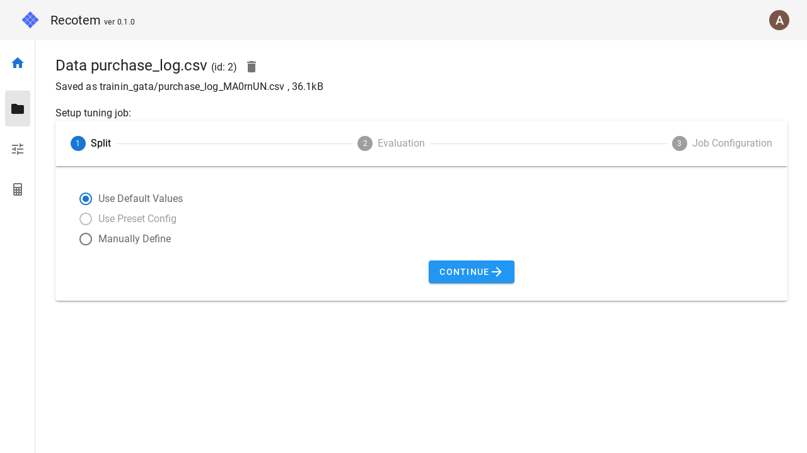

# チューニング設定画面(データ選択済み)

[データ管理画面](../data-list)あるいは[データ詳細画面](../data-detail)からこの画面に遷移すると、データ指定をスキップしてチューニング設定を行うことができます。

各ステップと[チューニング設定画面](../start-tuning)の対応関係は

- この画面のステップ 1. &leftrightarrow; [チューニング設定画面](../start-tuning)の ステップ 2.
- この画面のステップ 2. &leftrightarrow; [チューニング設定画面](../start-tuning)の ステップ 3.
- この画面のステップ 3. &leftrightarrow; [チューニング設定画面](../start-tuning)の ステップ 4.

となっています。

