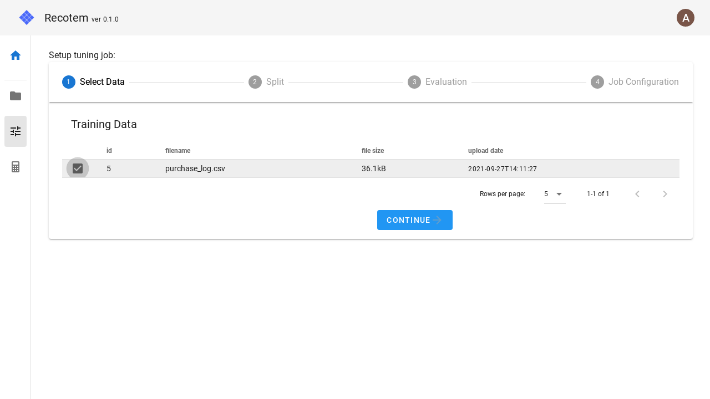
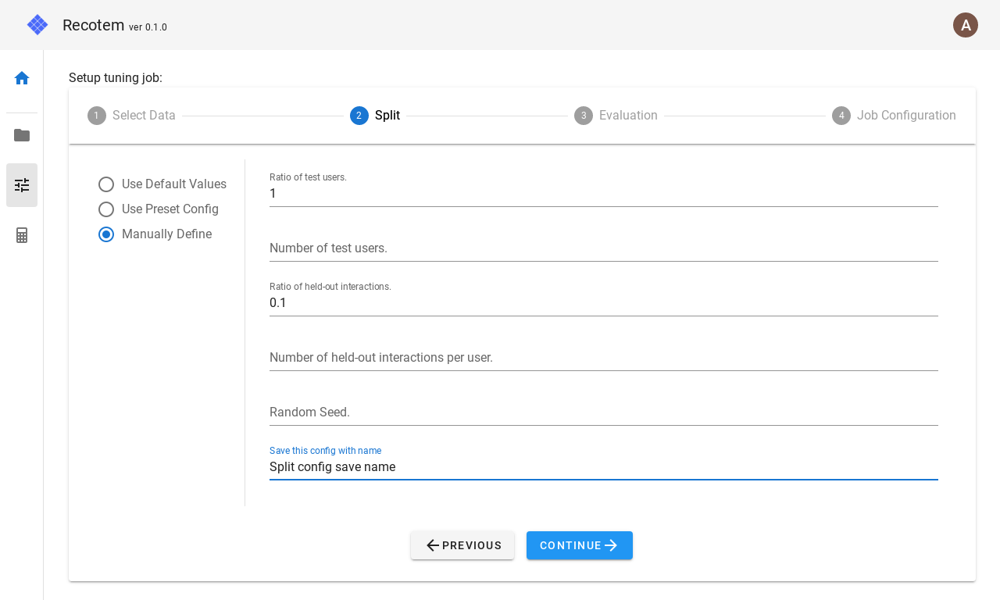
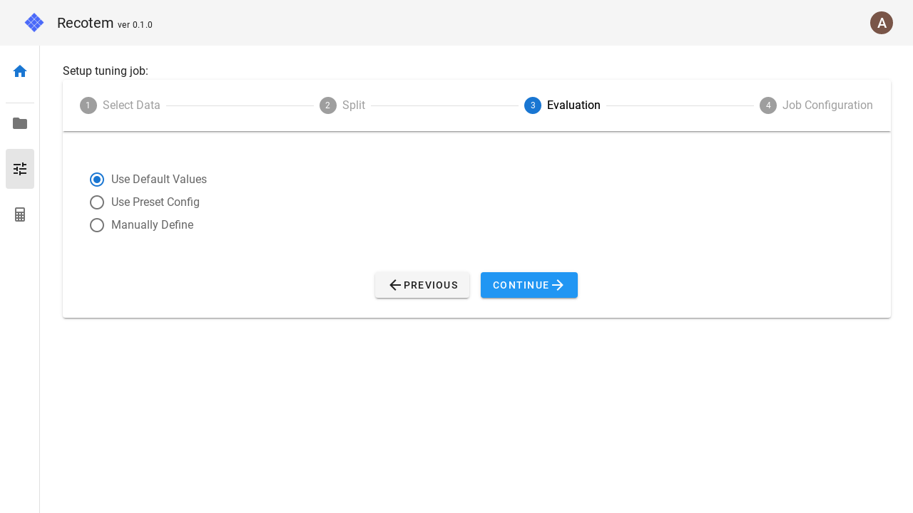

# チューニング設定画面

この画面では、4 ステップに分けてチューニングを行うことが出来ます。
これらのステップは、それぞれ以下に対応します。

1. アップロード済みデータの選択
2. 学習/検証セットへの分割設定
3. 評価指標の設定
4. チューニングジョブの設定

## 1. アップロード済みデータの選択

ステップ 1.ではアップロード済み学習データを選択します。"A training data file"と書かれた部分をクリックし、
アップロードする学習データを選択します。
この時、アップロードされるファイルはプロジェクト作成時に設定したユーザーを表す列、アイテムを表す列を含むテーブルデータである必要があります。

## 2. データ分割設定

ステップ 2.では学習データをどのように訓練/検証セットに分割するか、を指定します。

何も設定したくない場合は左のチェックボックスで "Use default" とすればデフォルト値が用いられます。

細かい設定をしたい場合は"Manually Define"を選択してください。

このモードでは、以下の項目が設定できます。

- **Ratio of test users** : 学習データに含まれるユーザーのうち、何割のユーザーに対して学習/検証分割が行われるか。この設定は、下の `Number of test users` が設定されている場合は無視されます。
- **Number of test users** : 学習データに含まれるユーザーのうち、何名のユーザーに対して学習/検証分割が行われるか。
- **Ratio of held-out interactions** : 学習/検証分割が行われるユーザーが接触したアイテムのうち、何割が検証データに回されるか。この設定は、下の `Number of held-out interactions per user`が設定されている場合は無視されます。
- **Number of held-out interactions per user** : 学習/検証分割が行われるユーザーが接触したアイテムのうち、何個が検証データに回されるか。これで設定した数に満たない接触履歴しか持たないユーザーは、学習用接触データ数は 0 となります。
- **Random seed**: 分割を行う際の乱数シード
- (任意)**Save this config with name** : ここに記載された名前で設定を保存します。ただし、名前が既存のものと重複しない必要があります。保存された設定は、次回からチェックボックスの "Use Preset Config"で選択できるようになります。

ここで設定された値を元に以下の手順で学習/検証分割が行われます。

1.  `Number of test users` あるいは `全ユーザー数 * Ration of test users`だけのユーザーがランダムに選択される
1.  1.で選択されたユーザーそれぞれに対して、 `Number of held-out interactions per user` あるいは `そのユーザーの接触アイテム数 * Ratio of held-out interactions`(切り上げ)だけの接触アイテムが検証に回される。このとき検証アイテムには

    - [プロジェクト設定時](../project-list)にタイムスタンプに相当するカラム列を設定した場合は、タイムスタンプが新しいものが
    - タイムスタンプ設定がなければランダムなものが

    選ばれます。

## 3. 精度指標設定

ステップ 3.ではどのような精度指標に基づいて最適化を行うかが設定できます。

何も設定したくない場合は左のチェックボックスで "Use default" とすればデフォルト値が用いられます。

細かい設定をしたい場合は"Manually Define"を選択してください。

このモードでは、以下の項目が設定できます。

- **Target metric** : NDCG, MAP, Recall, Hit の 4 指標が選択できます。
- **Cutoff** : 推薦スコアの上位何件でもって上記の指標を計算するか。
- (任意)**Save this config with name** : ここに記載された名前で設定を保存します。ただし、名前が既存のものと重複しない必要があります。保存された設定は、次回からチェックボックスの "Use Preset Config"で選択できるようになります。

## 4. チューニングジョブの設定

最後にチューニングジョブの設定を行います。ここでも何も設定したくない場合は左のチェックボックスで "Use Default Values" とすればデフォルト値が用いられます。

細かい設定をしたい場合は"Manually Define"を選択してください。

このモードでは、以下の項目が設定できます。

- **Number of trials** : 全部で何試行だけパラメータを試すか
- **Overall timeout** : 全体のタイムアウト
- **Single step timeout**: ある試行がこの値以上の時間を要する場合、その試行を強制停止します。
- **Rough memory budget** : 使用するメモリの（荒い）上限見積もり。これによってメモリ使用量の少ないアルゴリズムを選択することができます。
- **Number of Parallel tasks to be run** : 何並列でチューニングを実行するかを指定します。
- **Random seed** : 分割を行う際の乱数シード
- **Algorithms** : ここで指定されているアルゴリズムの中から最適なものを選択します。以下が選択可能です。
  - DenseSLIM
  - SLIM
  - IALS
  - AsymmetricCosineKNN
  - RP3beta
  - TopPop
  - TruncatedSVD
- **Train a model using the full data using the tuned configuration.** : ここにチェックが入っている場合、チューニングジョブが終了すると、全学習データ(訓練/検証分割をしない)に対して、探索済みパラメータを用いて学習されたモデルが作成されます。

最後に"START THE JOB"ボタンをクリックしてチューニングジョブを開始します。
ジョブが正常に開始すると、作成された[ジョブの詳細画面](../tuning-job-detail)へ移動します。
