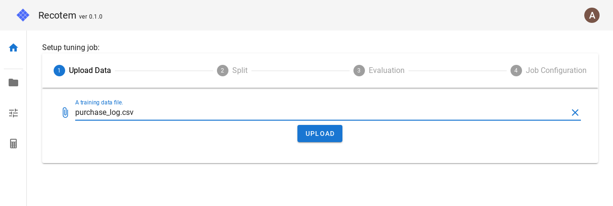
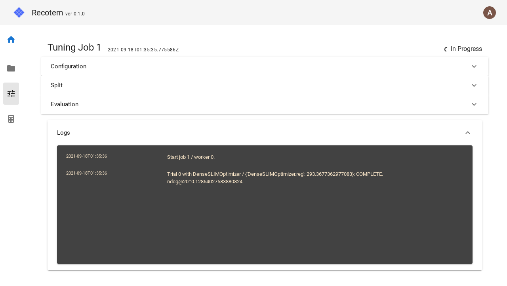
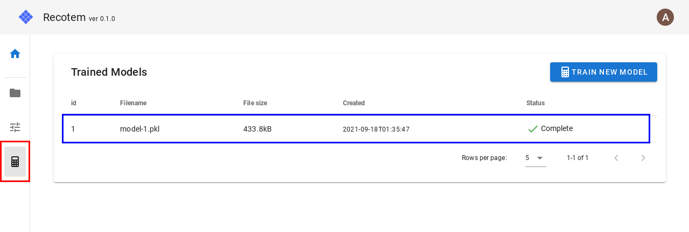

# EC サイトデータによるチュートリアル

このチュートリアルでは、とあるファッション EC サイトの購買ログ（ダミーデータ）を用いて、
recotem の基本的な用法である

- 学習データの形式の指定
- パラメータ調整ジョブの作成
- 推薦アルゴリズムの妥当性の確認

を学んでいきます。

## データの準備

このチュートリアルで使用する購買履歴データ `purchase_log.csv` を<a href="https://raw.githubusercontent.com/codelibs/recotem/refs/tags/v1.0.0/frontend/e2e/test_data/purchase_log.csv" download="purchase_log.csv" >こちら</a>からダウンロードします。 このデータは「どのユーザーがどの商品を購入したか」という情報を記録するシンプルな履歴データです:

| user_id | item_id |
| ------- | ------- |
| 1       | 49      |
| 1       | 69      |
| 2       | 21      |
| 2       | 57      |

## Recotem へのログイン

[http://localhost:8000](http://localhost:8000)にアクセスすると、以下のような画面で認証を求められます。[前項](./installation)でのインストールの直後は、

- ユーザー名: `admin`
- パスワード: `very_bad_password`

によってログインすることができます。

ユーザー情報を入力したら"Login"ボタンをクリックします。初期状態では、以下のような画面に遷移します。"Create"と書かれたタブをクリックします。

## プロジェクトの作成

Recotem を使うにあたって、最初に必要なのは「プロジェクト」と呼ばれる単位です。同じプロジェクト内では、複数のデータを扱うことができますが、データの形式は同一であることが求められます。

今回使用するデータの形式は以下のようなものでした。

| user_id | item_id |
| ------- | ------- |
| 1       | 49      |
| 1       | 69      |
| 2       | 21      |

ユーザーを表す列名はそのまま"user_id", アイテムは"item_id"ですから、その通り入力します:

"Create new project"をクリックすると、下のようなプロジェクトのトップ画面に異動します。

"Start upload -> tuning" をクリックします。

## パラメータ調整ジョブの作成

以下のような画面に移動しました。データに最も適したアルゴリズムやパラメータを探索するため、4 ステップでジョブを設定していきましょう。

推薦システムプロジェクトを始めるには、まずは学習データがなければなりませんので、アップロードしてきます。赤い枠のファイル入力欄をクリックすると、ファイル選択画面が現れるので、適宜先ほどダウンロードした`purchase_log.csv`を選択してください。

上の図のように、学習データが選択されると、"Upload"ボタンをクリックすることができるようになりますので、クリックして次に進みます。

すると、以下のような画面 (Step 2)に進みます。"Use default values"にチェックが入っていますので、そのまま"Continue"をクリックします。

以下のように Step 3 に進みます。こちらも"Use default values"にチェックが入っていますので、そのまま"Continue"をクリックします。

以下のように Step 4 に進みます。こちらも"Use default values"にチェックが入っていますので、そのまま"Start the job"をクリックします。

以下のような画面に移動していれば、最適なアルゴリズムとパラメータの探索が始まっています。

赤枠で囲った"Logs"というパネルをクリックすると、以下のように学習の進行状況を確認できます:

右上の学習ステータスが"In progress"から"Complete"に変われば、パラメータ探索が完了しています。
すると、"Logs"の上に"Results"というパネルが現れるはずなので、それをクリックしてパネルを開きます:

"Results"には探索されたアルゴリズムの示した性能やそのパラメータなどが記載されています。また、デフォルトでは探索されたアルゴリズムとパラメータを用いて、推薦モデルが作成されます。上図で赤枠で囲った緑の電卓アイコンをクリックすると、以下のようなモデルの詳細を確認する画面に移動します。

## 推薦結果の妥当性の確認

Recotem には、得られた推薦モデルがどのような推薦結果を返すのか、をプレビューする機能があります。
モデル詳細画面で "Preview results"と書かれたパネルをクリックすると、"Sample"というボタンが現れるので、クリックします。すると、以下のように推薦結果を表す JSON が出現します。

この JSON は「どのようなアイテムと接触したユーザーに、どのようなアイテムが推薦されるか」という情報を表していますが、このままではアイテムの ID の羅列であり、あまり推薦がうまくいっているという感覚は掴めないかと思います。そこで、アイテムのメタデータを Recotem にアップロードしてこのプレビューをより見やすくしましょう。

今回の購買ログデータにおけるアイテムのメタデータ `item_info.csv` は、 [ここ](https://github.com/codelibs/recotem/releases/download/v0.1.0.alpha4/item_info.csv)からダウンロードできます。このデータは以下のように、各々のファッションアイテムがどのようなカテゴリに属していて、値段はいくらだったかを表す表になっています。

| item_id | category | price |
| ------- | -------- | ----- |
| 1       | formal   | 61    |
| 4       | formal   | 111   |
| 5       | casual   | 106   |
| 6       | casual   | 178   |

Recotem に戻り、赤枠で囲われている画面左のフォルダアイコンをクリックすると、データ管理画面に移動します。既にアップロードした学習データが確認できますが、今回はメタデータをアップロードするので、青枠で囲われた"Upload"ボタンをクリックします。

以下のようにファイル選択を促されるので、赤枠をクリックし、ファイルを選択します。

ファイル選択後は "Upload" ボタンが選択可能になるのでそれを押せばアップロードが開始されます。
アップロードが完了したら先ほどのモデルプレビュー画面に戻りましょう。下の図で赤枠で囲った電卓アイコンをクリックするとモデル管理画面に移動します。先ほど作成したモデルも表示されるので、青枠で囲った行をクリックします。

先ほどのモデル詳細画面に遷移しました。再び "Preview results" パネルをクリックします。先ほどアップロードしたメタデータを用いてプレビューを行うため、下図赤枠で囲っている部分をクリックして先ほどアップロードした`item_info.csv`を選択します。

`item_info.csv`が選択された状態で "Sample" を押すと、下のようにより見やすい形で

- どのようなアイテムを購入したユーザーに
- どのような別のアイテムが推薦されるか

を確認することが出来ます。

Sample を何回か押していくと、ランダムなユーザーに対する結果が次々と表示されていきます。
ユーザーの`formal` vs `casual` のジャンル、購入価格帯に応じた好みをある程度反映した納得感のある推薦結果が表示され、モデルの作成が上手くいったことが分かります。
